I've been running with Windows 10 for the entire insider program. It was a rocky start but the current state is a an awesome computing experience.

Over the course of the last 10 months (Since October 2014) I've been keeping track of the things I like the most, so I've compiled this list:

**Virtual Desktops** a. Great for presentations b. Keeping email out of the way c. Starting fresh when you have a new project d. Hit Ctrl+Win+Arrow to move between and Win+Tab to get this view:

\[caption id="attachment\_5401" align="aligncenter" width="1858"\]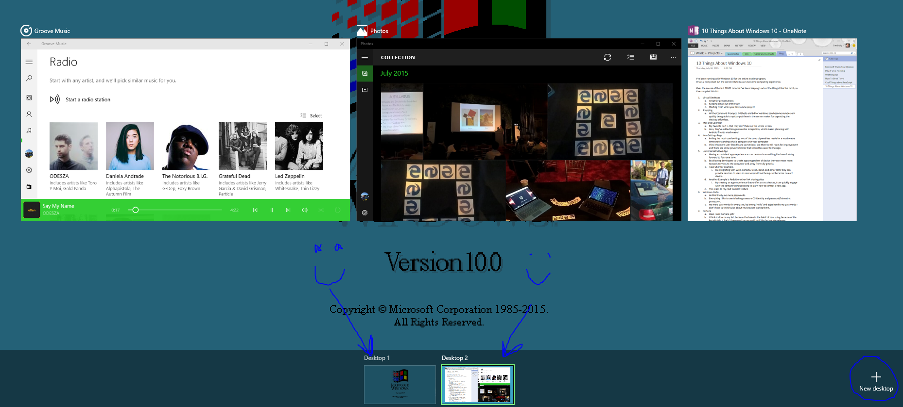 :)\[/caption\]

**Snapping** a. All the Command Prompts, GitShells and Editor windows can become cumbersom quickly being able to quickly put them in the corner makes for organizing the desktop effortless. b. Ahh yeah corners! c. When you have a window selected just press Win+Up/Down/Left/Right to get your windows in the right place

\[caption id="attachment\_5381" align="aligncenter" width="1920"\]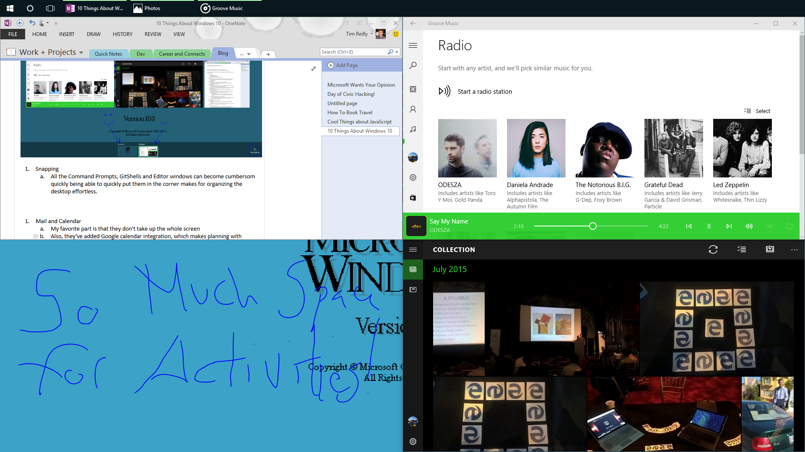 So much room for activities!\[/caption\]

**Mail and Calendar** a. My favorite part is that they don't take up the whole screen b. Also, they've added Google calendar integration, which makes planning with Android friends much easier. c. Win+S brings up search and type mail or calendar to begin

\[caption id="attachment\_5311" align="aligncenter" width="1920"\]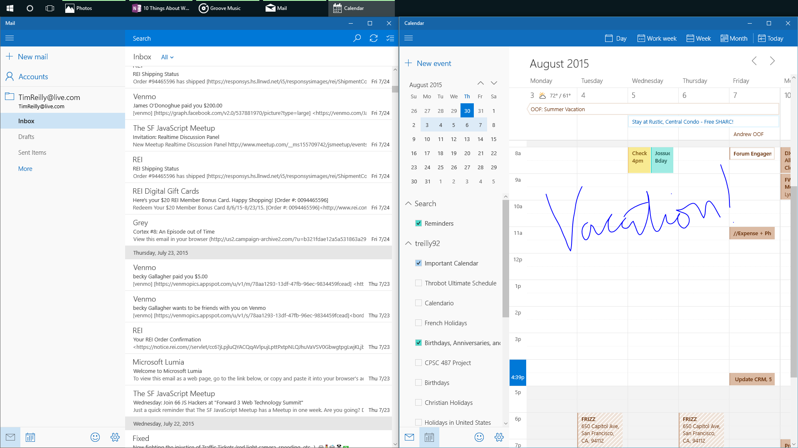 Responsive, Clear, and Compatible with Google Calendar. \[/caption\] **New Settings Page** a. Pulling the most used settings out of the control panel has made for a much easier time understanding what's going on with your computer b. I find this more user friendly and convenient, but there is still room for improvement and there are some privacy choices that should be easier to manage. \[caption id="attachment\_5361" align="aligncenter" width="1018"\]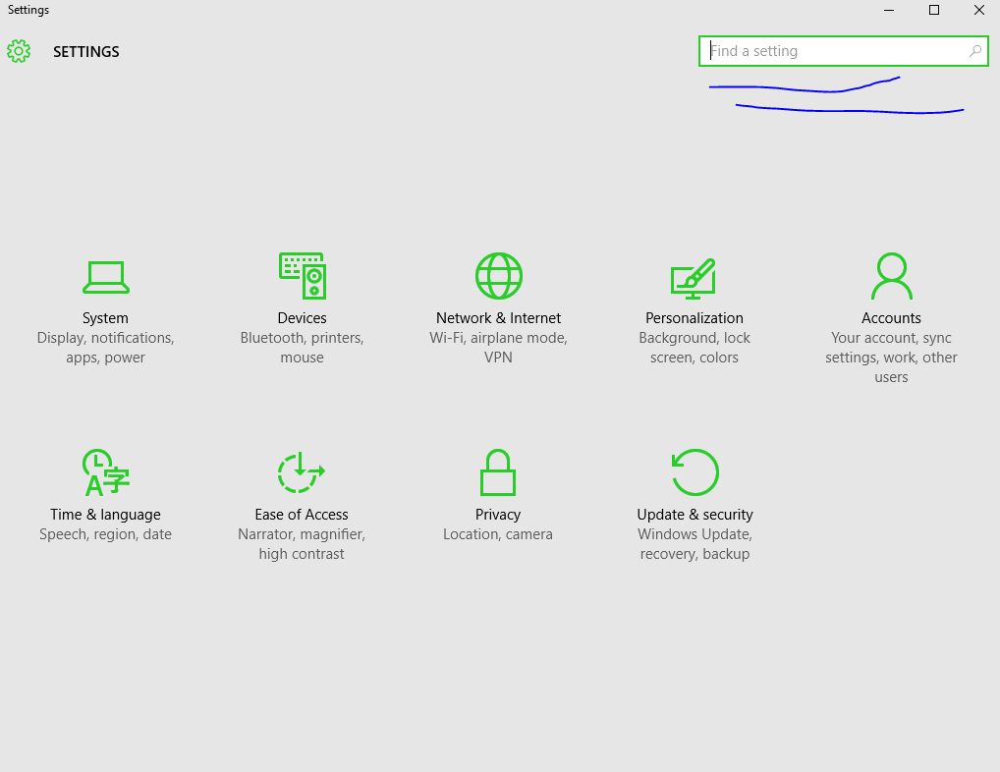 Touch Friendly\[/caption\] d. Also all the settings are searchable from Cortana or the settings menu for super quick configuration \[caption id="attachment\_5371" align="aligncenter" width="428"\]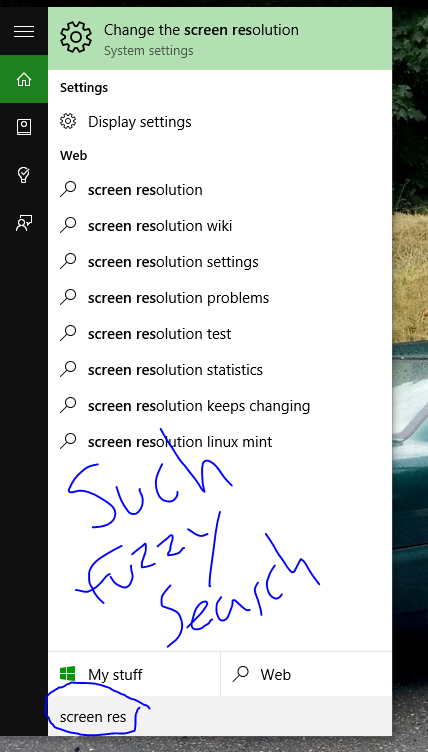 Using Search puts settings two clicks away. [Mozilla Complaint...](https://blog.mozilla.org/blog/2015/07/30/an-open-letter-to-microsofts-ceo-dont-roll-back-the-clock-on-choice-and-control/) Scott Hanselman [response](https://twitter.com/shanselman/status/626924419416326144) \[/caption\]

**Universal Windows App** a. Having a consistent app experience across devices is something I've been looking forward to for some time. b. By allowing developers to create apps regardless of device they can move more towards services to the consumer and away from silly gimicks c. Take Uber for example. By integrating with W10, Cortana, O365, Band, and other SDKs they can provide services to users in new ways without being cumbersome on each device. Another Example is Reddit or other link sharing sites By creating an app experience that unifies across devices, I can quickly engage with the content without having to learn how to control a new app. Here's the new Universal Twitter App looking good in the desktop: \[caption id="attachment\_5391" align="aligncenter" width="798"\]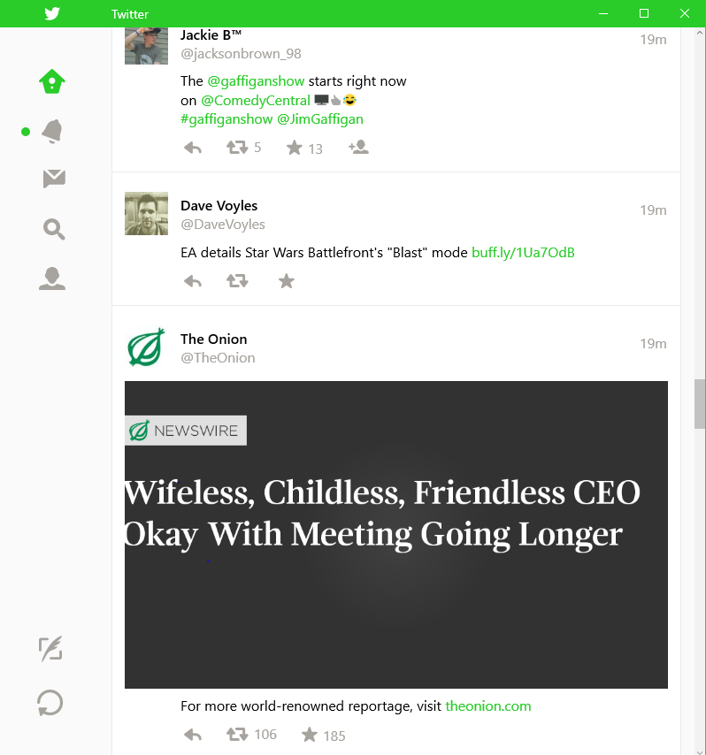 Learn more about Twitter and their [Universal App.](http://www.windowscentral.com/twitter-talks-about-design-its-universal-app-windows-10)\[/caption\] This leads to my next favorite feature

**Windows Hello** a. Ahhhh finally, no more passwords. b. Everything I like to use is behing a secure OS identity and password/biometric protection. c. No more passwords for every site, by letting 'Hello' and edge handle my passwords I don't have to think twice about my browser storing them.

\[caption id="attachment\_5411" align="aligncenter" width="1019"\]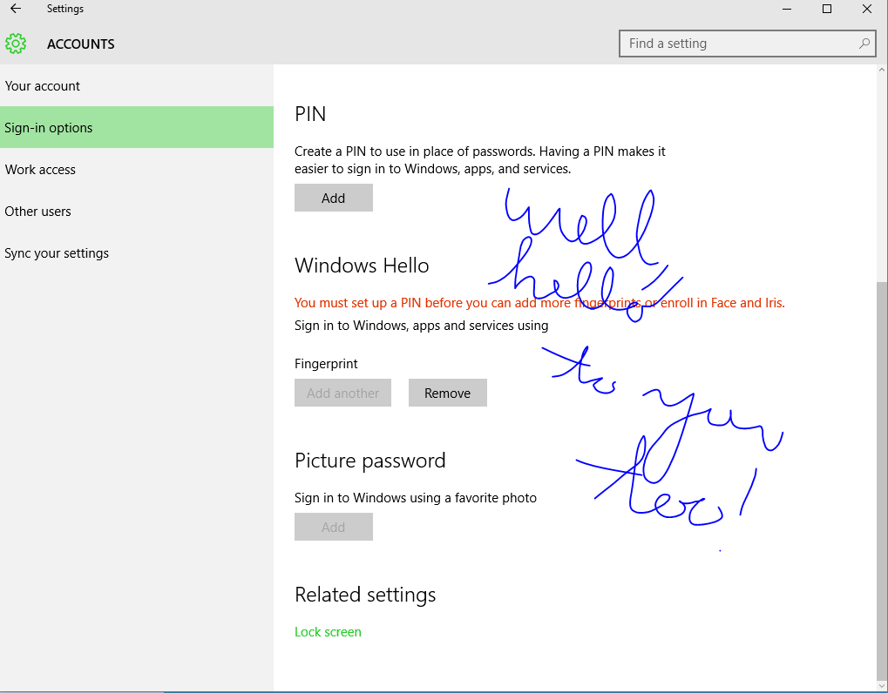 HELLO WINDOWS!\[/caption\] **Cortana** a. Have I said Cortana yet? b. I think its low on my list, because I've been in the habit of now using because of the Beta Builds. It hadn't been working very will until the last couple releases. c. Having said that, I am very excited about querying cortana instead of rifling through folder, documents, and applications. d. 4 Favorite Cortana Commands: Remind me to move the motorcycle at 7pm What's the weather like in Portland What's on my calendar today What's 20% of 80 (Tip Calculation)

\[caption id="attachment\_5321" align="aligncenter" width="414"\]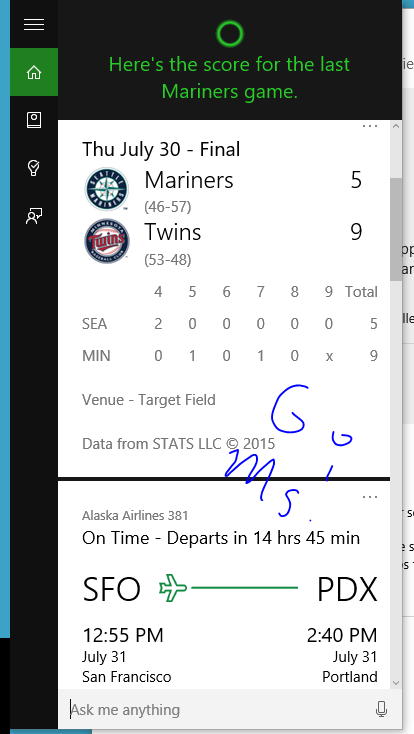 Go Ms! Scores, flights, tickets, meetings, travel times, all in one handy app. \[/caption\] **Groove & Pictures** a. The new Groove and Pictures apps are excellent. b. Groove I get a larger collection of music than Spotify for far less money. I can also control the experience with my voice 'Play… pause… next song… play playlist…' The app is responsive and fast c. Pictures Rich display of photos It looks nice It runs fast It does cool smart albums based on location and other tags It pulls my pictures from all of my computing history

\[caption id="attachment\_5331" align="aligncenter" width="1910"\]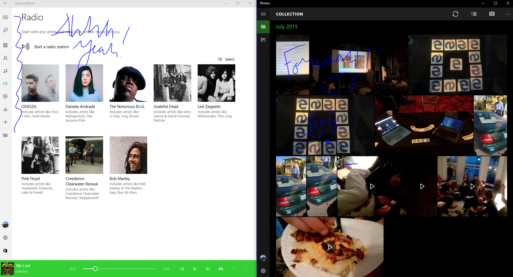 ODESZA Like the new background! [LINK](https://www.youtube.com/watch?v=bEBlEp85PNA)\[/caption\] **Snipping Tool and App/Game Recorder** a. The new snipping tool has a timer! Ahh that makes taking screen shots so much richer. b. I can now open a context menu, or show a menu that only appeared during a zoom c. The game recorder is really just fun to have when I get an occasional game of Poly Bridge, Goat Simulator, or Team Fortress in.

\[caption id="attachment\_5351" align="aligncenter" width="847"\]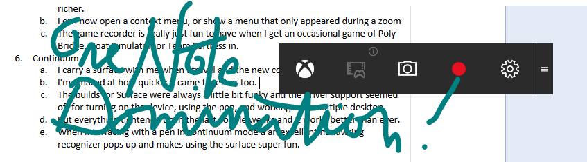 Record That... Awesome paragraph I just wrote!\[/caption\] **Continuum** a. I carry a surface with me when I travel and the new continuum feature is spot on. b. I'm amazed at how quickly it came together too. c. The builds for Surface were always a little bit funky and the driver support seemed off for turning on the device, using the pen, and working with multiple desktop. d. But everything tightened up in the last couple weeks and it works better than ever. e. When interfacing with a pen in continuum mode a an excellent handwriting recognizer pops up and makes using the surface super fun.

If you have any questions about Windows 10 feel free to reach out!

\[caption id="attachment\_5461" align="aligncenter" width="3552"\]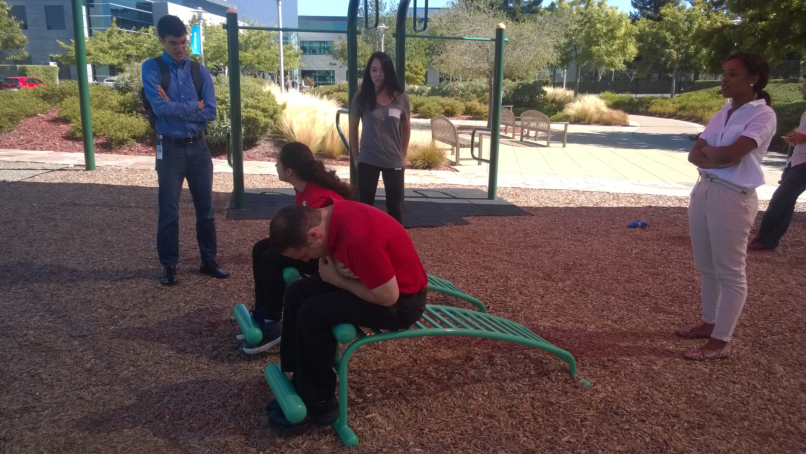 SITUP CONTEST!!! Kat and John are fit. \[/caption\]

10 Awesome Features of Windows 10!
