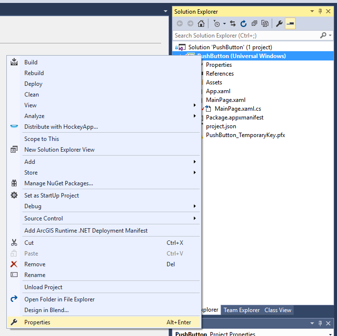
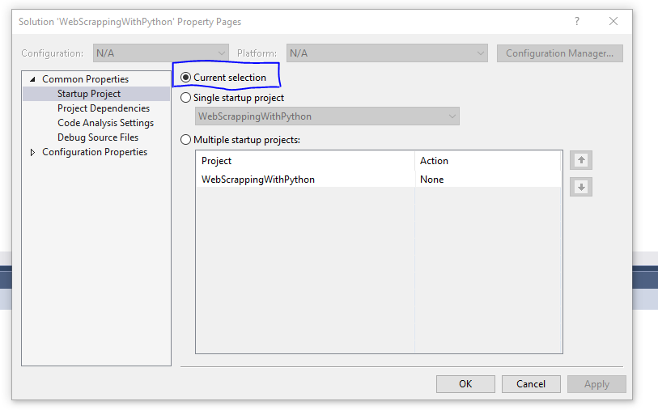
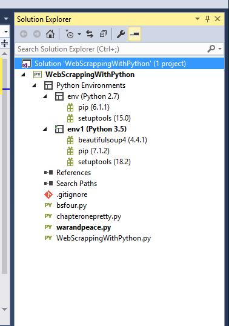

I've been working a lot with Visual Studio Code the last couple weeks, but recently made the switch back to Visual Studio Community Edition with Python tools for Visual Studio because of three handy shortcuts and one awesome virtual environment manager.

**Those three shortcuts are...**

**Ctrl+F5** Run without debugging. This sends your python file to the virtual env you have activated to a terminal right next to your project. Which on its own is cool and handy, but when you right select your solution then select properties:  You can set it to run whatever file you're currently editing, which makes hoping around different files as your learning so nice. 

The next shortcut is...

**Alt+Shift+F5** Send file to interactive

This is great for when you're just learning about a new library and you keep piecing together what you understand into the file.

Just keep hitting Alt+Shift+F5 send it to the interactive mess around in the terminal with the new objects you've created then determine the best logic and send it back into your file.

You break something?

Just send it back in... perhaps using our final shortcut:

**Ctrl+E, Ctrl+E** Send selected text to interactive

Don't let the comma throw you off, just selected some text and hit ctrl+e twice to run that code in the REPL. This in conjunction with Alt+Shift+F5 make it so pleasant to work in Visual Studio with Python.

Visual Studio is great and all, but if I need to learn some new library or work through a tutorial the robustness and Experience of Visual Studio is tough to beat.

Oh yeah, not related to shortcuts but still awesome is Virtual Environment Support:  Those env's I created by right clicking on Environments and selecting new virtual environment. There is support for both versions of Python and to install just use pip by right clicking on the env and install from pip!

I'll let this nice video they've created break it down: Skip to 9 minutes in to see the Virtual Env Breakdown 

<iframe width="560" height="315" src="https://www.youtube.com/embed/KY1GEOo3qy0" frameborder="0" allowfullscreen></iframe>

Happy Holidays Everyone! 
