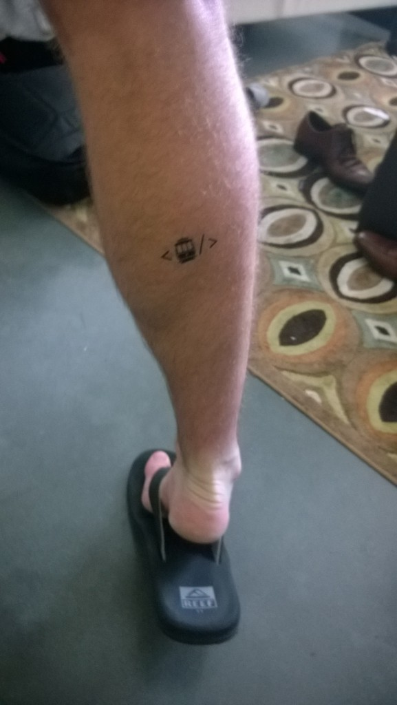

This week I've been making progress on the Huggable Cloud Pillow website.

In the process I've learned about some sweet stuff you can do with Javascript, Python, and Flask-SocketIO.

The first thing to take note of is Flask.

Flask is the tiny server that allows us to host websites using Python to deliver content to the client. While on the server side you can manage complicated back ends or other processes using Python in conjunction with Flask.

This type of development is nice, because you can start seeing results right away but can take on big projects easily.

It might not be the most robust Framework, but its great for small projects…

If you want to get into Flask Web Development checkout this extensive [MVA](http://www.microsoftvirtualacademy.com/training-courses/introduction-to-creating-websites-using-python-and-flask).

Small and simple, Flask is static on its own. This allows us to present static content, like templates and images easily and deals with input from the user using RESTful calls to receive input. This is great for static things with lots of user actions, but if we want something a bit more dynamic we're going to need another tool.

In this case I've found Flask-SocketIO, similar to Flask-Sockets but with a few key differences highlighted by the creator ([Miguel Grinberg](https://twitter.com/miguelgrinberg)) [here](http://blog.miguelgrinberg.com/post/easy-websockets-with-flask-and-gevent).

Sockets are great for is providing live information with low latency. Basically, you can get info on the webpage without reloading or waiting for long-polling.

There are lots of ways you can extend this functionality to sharing rooms and providing communication with users and all sorts of fun stuff that is highlighted on GitHub with a great chunk of [sample code.](https://github.com/miguelgrinberg/Flask-SocketIO/tree/master/example) The following demo is based off of these samples.

For my project, I need the webpage to regularly check for differences in the state of the cloud and present them to the client, while also changing the image the user sees.

At first I tried to implement it using sockets passing information back and forth, but that wasn't very stable.

The solution I've found, uses a background thread that is constantly running while the Flask-SocketIO Application is running, it provides a loop that I use to constantly check state of our queue.

Let's break it down… a. I need my website to display the current state of the cloud. b. The Flask application can get the state by query our azure queue. c. Once we determine a change of state we can display that information to the webpage. d. To display the new state to the webpage we need to use a socket. e. And pass the msg to be displayed.

This demo intends to break down problem a, c, d, and e.

I've created this little guide to help another developer get going quickly, with a nice piece of code available on GitHub.

**The five steps to this little demo project are as follows:** 1. Install Flask-SocketIO into our Virtual Environment 2. Create our background thread 3. Have it emit the current state to our client 4. Call the background thread when our page render\_template's 5. Have the Javascript Catch the emit and format our HTML. Celebrate! Its Friday!

**1.**

Flask-SocketIO is a python package that is available for download using

`pip install Flask-SocketIO`

Make sure you instal it into a Virtual Environment. [Check out my earlier tutorial](http://timmyreilly.azurewebsites.net/python-flask-windows-development-environment-setup/) if you need help with this step.

\*Edit Here's the top part of the "main.py" for reference: \[sourcecode language="python"\] #main.py from gevent import monkey monkey.patch\_all()

import time from threading import Thread from flask import Flask, render\_template, session, request from flask.ext.socketio import SocketIO, emit, join\_room, disconnect

app = Flask(\_\_name\_\_) app.debug = True app.config\['SECRET\_KEY'\] = 'secret!' socketio = SocketIO(app) thread = None \[/sourcecode\]

**2.**

Create our background thread. You'll see in the sample code from Flask-SocketIO's github a simple way to send data to the client regardless of their requests.

For this example we'll be changing the current time every second and display that to our client.

Background Thread:

\[sourcecode language="python"\] def background\_stuff(): """ python code in main.py """ print 'In background\_stuff' while True: time.sleep(1) t = str(time.clock()) socketio.emit('message', {'data': 'This is data', 'time': t}, namespace='/test') \[/sourcecode\]

**3**

This is the emit statement from above, but is the meat of our interface with SocketIO. Notice how it breaks down...

\[sourcecode language="python"\] socketio.emit('message', {'data': 'This is data', 'time': t}, namespace='/test') socektio.emit('tag', 'data', namespace) \[/sourcecode\]

This emit will be sending to the client (Javascript) a message called 'message'.

When the Javascript catches this message it will be able to pull from the python dicionary msg.data and msg.time to get the result of this package.

**4**

So how do we call background\_stuff?

We can call it wherever we want, but for this simple example we'll put it right in our '/' base route. So when we navigate to 127.0.0.1:5000 (Local Host) we'll see the result of our background thread call.

Here's our route:

\[sourcecode language="python"\] @app.route('/') def index(): global thread if thread is None: thread = Thread(target=background\_stuff) thread.start() return render\_template('index.html') \[/sourcecode\]

Pretty simple… Notice global thread and target=background\_stuff

Creating different background threads is a good way to iterate through your changes. **5**

Next step is catching this on the other side… So for our Javascript… we'll be using the socket.on method.

\[sourcecode language="javascript"\] socket.on('message', function(msg){ $('#test').html('&lt;p&gt;' + msg.time + '&lt;/p&gt;'); }); \[/sourcecode\]

When we receive the emit labeled 'message' we'll pick up the msg from the second parameter and have it be available to our JQuery work.

Here's the small piece of HTML that we're selecting to edit.

\[sourcecode language="html"\] <body> 
Hello
 </body> \[/sourcecode\]

[I've posted all of this code at github](https://github.com/timmyreilly/Demo-Flask-SocketIO).

Feel free to download it and start working with dynamic sites using SocketIO. Please let me know if you have any questions!

\[caption id="attachment\_4971" align="aligncenter" width="577"\] Code for SF's Hackathon gave out awesome tattoos!\[/caption\]
