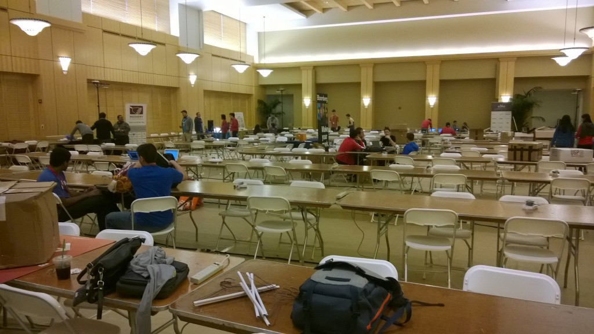

These are things that I've found drive successful teams at Hackathon's

**Fundamental Principal:**

> You win by creating a good hack and presenting it well.

We'll break this into two sections.

**First: Create a good Hack** Build Small Make it a topic you're an expert in Make it useful to you -> Build something you want Try to find something that takes 3 or more clicks and turn it into 1 click Use the Mentors to learn and create Use the mentors to determine if you have a good project Use GitHub Take Advantage of the APIs and Sponsor Solutions - they'll help you get far Don't build a working prototype Build a robust demo application Make it smoke and mirrors if necessary Looks can go a long way to engaging customers Follow the money (especially if you don't want to start a company) Make it engaging Whiteboard Brainstorm Break down problems as you face them Delegate amongst your team Ask Why? Don't sit idle Make friends Spend time talking to the organizers Tell a story Stick to the fundamentals Work to each teammates strength Find a quiet space to focus Watch the clock Don't get discouraged, enter another Hackathon Go to the talks to learn more Network Take some photos, take a walk, clear your mind Most importantly, Have Fun!

**Second: Present it well** Practice your pitch Talk about these things: What's the problem, how you fixed it Tell a story Don't push back against questions Have fun Get up in front of people and make them listen to it The mentors are good people to practice with Use the science fair time to rehearse Use the most articulate person on your team to present Let the Sponsors know you used their product Have a clear submission on Challengepost Stick to the demo you're comfortable with -> Don't present Alpha on stage

The above tips are to warn and tip you off about the potential pitfalls of the next 24+ hours.

I think an example itinerary might help hackers who are serious:

**1\. Pregame**

Go to the booths Talk to the sponsors about their prizes Brainstorm as you go from table to table Engage with other hackers while you wait to talk Ask them if they have any ideas if they have a team Join a team of 1 to 4 Hash out a couple ideas - Three is a good number to take to the next phase No writing just speaking

**2\. Learn and Plan**

Learn the why? and how? of your project Go to talks if you need to brush up on tech Talk to mentors about what needs to get done Find resources that will help you accomplish your how

Get on a whiteboard Wire frame Prototype and create user models Talk to your team about the plan Communicate what everyone is doing Spend time setting up dev environments Get going with source control Practice a push or two to make sure everything works Practice using GitHub! Delegating a head developer isn't a bad idea

**4\. Create**

Start small Get the first things in place as a team so everyone understands the framework Begin to delegate as more pieces need to be worked in Find a quiet spot where you can focus Delegate tasks Don't be afraid to ask for help Continue to learn as you work. Commit small changes Spin up a VM or website to host your project and database

**5\. Submit**

Submit early Make your challenge post clear Stop Building

**6\. Present**

Practice your pitch and presentation Know your demo back and front Try to get feedback from the demo hour Get on stage! Perform!

**7\. Reflect**

Something happened in the last 24 hours... Don't let if slip your mind Try to spend some time journal-ing about the experience Pool the resources you acquired Update your resume Sign up for the next hackathon -> It will be better than the first.

If you came to this hackathon and you feel totally out of your element that's okay. Hackathons are a great place to be out of your comfort zone, there's food, friends, and things to learn. I have a sample itinerary for those folks as well:

Go to the booths. Ask the mentors questions about their companies. Ask them about computer science and development in general. Ask them why?

Find people who are in a similar boat and hang out with them, ask them about their experience with computers and computer science.

Go to the sessions to learn about development.

Start with Code Academy and move onto development with Touch Develop, Python, or JavaScript. Make something tiny.

Shoot for something adorable.

Practice using GitHub take tutorials online

Go around asking groups about their hacks, ask if they need users to test their interfaces.

Go to the presentations -> Take note of the good presenters, take note of the good demos

Connect with the people you met on Facebook.

Reflect (Like above)

Having said all that... You are here to learn and challenge yourself to do your best. Nobody is going to die. Take this time to put something behind you and move forward in your pursuit of Technical expertise.

\[caption id="attachment\_3701" align="aligncenter" width="660"\] This is what a Hackathon Looks like before Hackers arrive. The tables look barren. \[/caption\]
