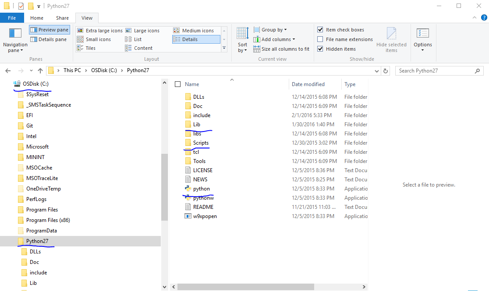
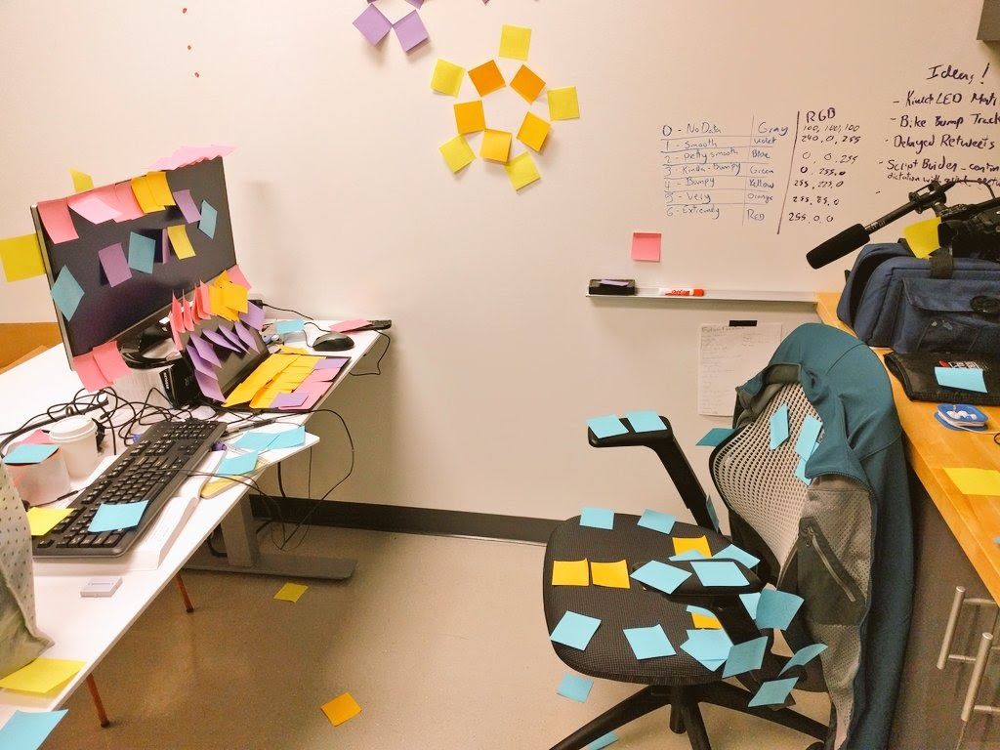

Well you got just your new Windows PC. Hopefully a crispy Surface Pro 4 (Starting at $899)

And you want to learn how to program, and Python is the language you're going with. Or you already know how to program and this is the first windows PC you've used in a while and like Python. I don't know you…

Well that's fine too.

All the code and resources associated with this post can be found on [GitHub](https://github.com/timmyreilly/onehourpython/tree/windows)

If at any point you get lost or confused, feel free to raise your hand/add a comment or PM me on twitter [@timmyreilly](http://twitter.com/timmyreilly)

In this course we'll cover: 1. Installing Python 2. Using the REPL 3. Running our first program 4. Examining the Python Folders 5. Using Pip 6. Creating, installing to, and using virtualenv and virtualenvwrapper-win 7. Examining the Envs folders! 8. setprojectdir and Workflow 9. Visual Studio 10. Virtual Envs in VS 11. Exploring Visual Studio Directories 12. Using the REPL in VS 13. Shortcuts for VS 14. Continued Learning

**1\. Installing Python**

[Windows](http://timmyreilly.azurewebsites.net/python-pip-virtualenv-installation-on-windows/)

**2\. Using the REPL**

The REPL stands for Read Evaluate Print Loop

Makes iterating and testing easy!

Type python into your command prompt

`C:\..\> python Python 2.7... >>>`

try these commands: `>>> x = 2 + 2 >>> print x >>> import this >>> type(x) >>> dir(x)`

[More Practice](http://timmyreilly.azurewebsites.net/python-introduction/)

**3\. Running our first program**

Use your favorite text editor. I'm using [Visual Studio Code](https://code.visualstudio.com/)

I've named my example: [beginnings.py](https://github.com/timmyreilly/onehourpython/blob/windows/README.md)

\[sourcecode language="python"\] sentence = "Four score and seven years ago" sentence\_no\_vowels = "" for letter in sentence: if letter not in "AEIOUaeiou": sentence\_no\_vowels = sentence\_no\_vowels + letter print sentence\_no\_vowels \[/sourcecode\]

**4\. Examining the Python Folders**

So because we're on windows let's take a look and explore our current folder structure just to get familiar with how Python works.

We'll also show some helpful ways of interacting with python in our terminal

Calling Python Explicitly `> C:\Python27\python.exe` Calling Pip directly `> C:\Python27\Scripts\pip.exe list` Using Easy Install `> C:\Python27\Scripts\easy_install.exe` What Else is in there? `> dir C:\Python27\`

**5\. Using Pip**

Install a package Python Packages are installed with pip

We'll install [requests](http://docs.python-requests.org/en/latest/)

`> pip -v > pip install requests` Uninstall a package `pip uninstall requests`

**6\. Creating, installing to, and using virtualenv and virtualenvwrapper-win**

To another [Blog Post](http://timmyreilly.azurewebsites.net/python-flask-windows-development-environment-setup/) for these steps.

**7\. Examining the Envs folders!**

Now that we've used our first virtual environment where is it? Let's go find it! The files are in the computer!

`> C:\Users\tireilly\Envs\helloworld\Scripts\pip.exe list > C:\Users\tireilly\Envs\helloworld\Scripts\easy_install.exe`

**8\. setprojectdir and workflow**

That was fun. Let's do it a lot.

cd into root of project

`> workon newProject > cd newProjectDirectory > setprojectdir . > deactivate > workon helloworld`

Now that was all fun and agnostic. Let's dive into Visual Studio.

**9\. Visual Studio**

\- [Community Edition](https://www.visualstudio.com/en-us/products/visual-studio-community-vs.aspx) is Free and Awesome! - And there's support for extensions like PTVS: [http://microsoft.github.io/PTVS](http://microsoft.github.io/PTVS) \- It’s a beast! - Great for debugging, large projects and working with many different technologies. The python offering is found in the form of Python Tools for Visual Studio.

_The three things I want to introduce are Virtual Envs, the REPL, and Shortcuts_

**10\. Virtual Envs in VS**

\- Visual Studio will Manage Virtual Environments for you!

https://www.youtube.com/watch?v=eKPeC1remt4

**11\. Exploring Visual Studio Directories**

`> C:\visualstudio\projects\OneHourPython\OneHourPython\env\Scripts\pip.exe > C:\visualstudio\projects\OneHourPython\OneHourPython\env\Scripts\python.exe`

Check them out in the directory too!

**12\. Using the REPL in VS**

https://www.youtube.com/watch?v=JNNAOypc6Ek&feature=iv&src\_vid=TuewiStNT0M&annotation\_id=annotation\_3141657985

**13\. Shortcuts for VS**

Make it [buttery](http://timmyreilly.azurewebsites.net/3-shortcuts-that-justify-opening-visual-studio/)

\- Ctrl+F5 = _Run Without Debugging_ \- Ctrl+E, Ctrl+E = _Selected text to interactive_ \- Alt+Shift+F5 = _Send file to interactive_

That's it for now, but don't stop here the funs about to start!

**Continued Learning & Other Resources:** Try [Azure](https://azure.microsoft.com/en-us/?b=16.11a) Take your ideas of the Ground: [BizSpark](https://www.microsoft.com/bizspark)

Now that we've taken our first couple steps with Python, where should we go next?

See all the code associated with this project and more resources on my [GitHub](https://github.com/timmyreilly/onehourpython/tree/windows)!

Please contact me if you have any questions: [@timmyreilly](http://twitter.com/timmyreilly)

\[caption id="attachment\_6921" align="aligncenter" width="1024"\] This is what happens when you get coffee on your birthday...\[/caption\]
