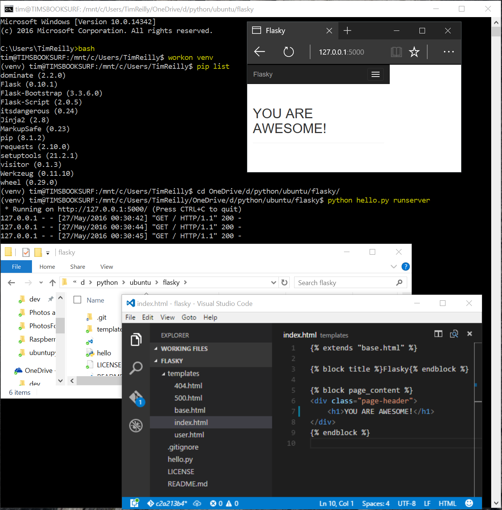

Now that bash is on Windows, I wanted to try and make all the other guides I'd writen for Python on Windows irrelevant.

So here's how to setup an effective environment for Python on Ubuntu on Windows. **1\. Install Bash on Windows 2. Check for updates 3. Check out the REPL 4. Install Pip 5. Install VirtualEnv 6. Install VirtualEnvWrapper 7. Create your first virtualenv 8. Configure bashrc to keep it working 9. Install some packages 10. Test Flask**

**1\. Install Bash on Windows:** [Here's the announcement blog for context.](https://msdn.microsoft.com/en-us/commandline/wsl/about) [How to Geek has a good breakdown of making it happen.](http://www.howtogeek.com/249966/how-to-install-and-use-the-linux-bash-shell-on-windows-10/)

Make sure you remember your password.

Now that its installed try opening a command prompt and typing bash. The prompt should change like this: 

Notice that path? `/mnt/c/Users/TimReilly`

That's your user directory for windows where your OneDrive, Documents, Desktop, etc. exist.

You can go in there now and run python scripts that might already exist, but your probably won't have all the necessary packages installed.

Before we move forward we want to make sure Ubuntu is up to date.

**2\. Check for updates** From another command prompt: `lxrun /update`

And inside bash `sudo apt-get update`

[Thanks reddit for the tips!](https://www.reddit.com/r/bashonubuntuonwindows/comments/4go0ek/major_update_to_bash_on_windows_27042016/)

**3\. Check out the REPL**

Now run python! `$ python`

Should look like this: 

**4\. Install Pip**

Now we'll install Pip: `sudo apt-get install python-pip`

If you have permission issues try starting an elevated prompt: `$ sudo -i` `$ apt-get install python-pip` `$ exit`

Use exit to return to the regular prompt. Should look like this:  Yay we've got pip! Try `pip list` to see what comes standard.

**5\. Install VirtualEnv** Now we're basically following along with the guide presented at [hitchhikersguidetopython.com](http://docs.python-guide.org/en/latest/dev/virtualenvs/)

Again, you might need to start an elevated prompt to install virtualenv. `$ sudo -i $ pip install virtualenv $ exit $ cd my_project_folder $ virtualenv venv` Then to use the VirtualEnvironment `$ source venv/bin/activate`

You should now see a little (venv) before your prompt. Like this: 

Now you've created a virtualenv inside of your my\_project\_folder directory. Which is cool, but can be confusing with git, sharing code, and testing package versions. So we use VirtualEnvWrapper to keep our virtualenvs in the same place.

_Before we move on make sure you deactivate your env_ `deactivate`

**6\. Install VirtualEnvWrapper**

http://virtualenvwrapper.readthedocs.io/en/latest/index.html

`$ pip install virtualenvwrapper $ export WORKON_HOME=~/Envs $ source /usr/local/bin/virtualenvwrapper.sh`

$ export WORKON\_HOME=~/ Can be customized to whichever directory you'd like to place your virtualenvs

**7\. Create virtualenv using virtualenvwrapper** `$ mkvirtualenv venv $ workon venv $ deactivate`

Here's an example of what it looks like to remove our venv directory and instead use venvv which will be stored in the directory underlined in red.

**8\. Configure bashrc to keep it working**

This might not happen to you, but when I opened a new bash terminal I had to re-source my virtualenvwrapper.sh and WORKON\_HOME.

So instead I added those lines to my bashrc script. `$ sudo nano ~/.bashrc -- type in password --` This is what it looks like in nano for me. Ctrl+X to exit and y-enter to save. 

Then either: `Source ~/.bashrc` Or start a new command prompt->bash and try "workon" or "lsvirtualenv"

See the next image for a simple workflow.

**9\. Install some packages**

Now lets install 'requests' into our newly created virtualenv: 

Isn't that nice!

**10\. Test Flask** Finally we're going to test this with flask. First we install the required files using pip into our activated 'venv' Then runserver -> navigate to the designated address -> and see our site.

Here's what it looks like: 

Have fun building with Python, on Ubuntu, on Windows!

\[caption id="attachment\_7541" align="aligncenter" width="3024"\] Sometimes you gotta tie a pizza to your bike.\[/caption\]
