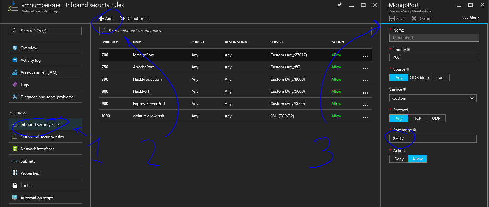
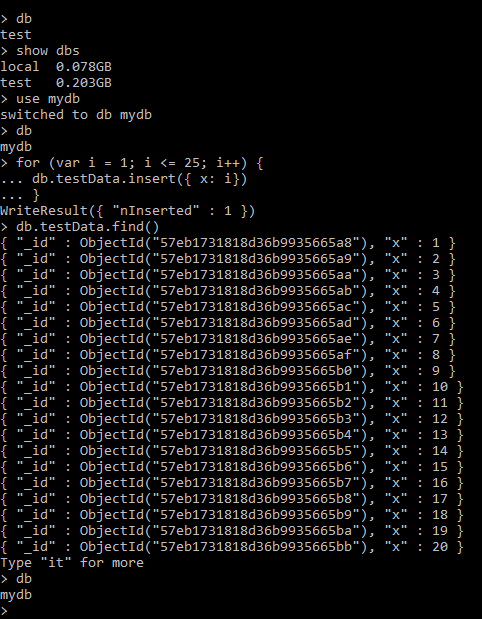

You just setup a VM and you want to store data!

You checked out [Document DB](https://azure.microsoft.com/en-us/services/documentdb/), but decided Mongo was more your style.

Prereqs: An [Ubuntu Virtual Machine](http://timmyreilly.azurewebsites.net/intro-to-ubuntu-virtual-machines-on-azure/) in Azure

Let's get started!

There are four steps: 1. Open the appropriate port on Azure 2. Install Mongo 3. Configure Mongo to connect to all external IPs 4. Connect your application

**1\. Open the appropriate port on Azure**

Go to your virtual machine's landing page and select the resource group in the top left corner: 

[Resource groups](https://azure.microsoft.com/en-us/documentation/articles/resource-group-overview/) are the way Azure breaks down how our VM interacts with the internet, other VMs, storage, and public/private networks.

To open the port we need to change our [Network Security Group](https://azure.microsoft.com/en-us/documentation/articles/virtual-networks-nsg/), which is represented by the shield and underlined in the screenshot above.

Then, once you've selected the Network Security Group, select Settings -> Inbound Security rules

\[caption id="attachment\_8711" align="aligncenter" width="1444"\] This will allow us to open up our VM to the Public Internet via a port that we'll connect our client side application to. \[/caption\]

You'll notice that SSH is already included, that's what we're using in our terminal. You may also have other ports opened if you've followed some of my other posts.

We're going to create a new Inbound Security Rule called MongoPort where we'll set the Destination port range to 27017 (the default port for MongoDB)

You can see the configuration pane in the screenshot above identified as item 3.

Once you hit 'Okay' or 'Save' the port will be opened in a couple seconds.

You should see a notification in the top right corner once completed. Now the port is available to the open internet, but Mongo isn't installed or configured to be listening at that port. So let's get to it.

**2\. Install Mongo**

Installing Mongo on Ubuntu is easy and well documented by the MongoDB group. Just enter a few commands and you'll be up and running in no time.

I followed the directions provided by docs.mongo.com - [https://docs.mongodb.com/manual/tutorial/install-mongodb-on-ubuntu/](https://docs.mongodb.com/manual/tutorial/install-mongodb-on-ubuntu/)

Make sure you're following along with the directions for your specific instance of Ubuntu.

To check your version of Ubuntu enter: `$ lsb_release -a`

Once you've followed the directions provided by Mongo, here are some other helpful commands to make sure everything is configured properly.

See a log of what MongoDB is doing: `$ cat /var/log/mongodb/mongod.log`

See all the processes running on your machine: `$ ps -aux`

See all the processes with mongo in the listing: `$ ps -aux | grep mongo`

See the status of the ports: `$ netstat -ntlp`

Here's what the bottom of my log file looks like as well as a double checking of the current status of Mongo and what port its running on.

Before we access this DB from our application we need to change one setting so Mongo accepts connections from different IP addresses besides the local IP address.

**3\. Configure Mongo to connect to all external IPs**

Before we go on, I need to make it clear that **this is not a best practice**, and no user data should be stored on a VM with an open port like this. But for development and practice purposes we're going to make it easy to connect.

If you're going to go into production, please refer to MongoDBs security checklist [HERE](https://docs.mongodb.com/manual/administration/security-checklist/).

Okay, having said that.

Open up the mongod.conf file using nano:

`$ sudo nano /etc/mongod.conf`

And uncomment the binding IP by adding an octothorpe at the beginning of the line like so:

Save and close the file. ( Ctrl+X -> y -> enter )

Alright, now MongoDB should be ready to be connected to!

4\. Try it out and Connect your application

Open the Mongo Command line by typing mongo in your ssh terminal. And show your DBs and collections `show dbs` `show collections`

Here's the getting started tutorial from Mongo that I found helpful: [https://docs.mongodb.com/v2.6/tutorial/getting-started/](https://docs.mongodb.com/v2.6/tutorial/getting-started/)

And a great way to generate some test data to get familiar with your Databases and collections: [https://docs.mongodb.com/v2.6/tutorial/generate-test-data/](https://docs.mongodb.com/v2.6/tutorial/generate-test-data/) Here's what it looked like for me!

The connection string for the VM is the IP address and the DB you'd like to write too. To connect to the test database on the is vm the connecion string to use looks something like this:

`mongodb://40.83.182.555:27017/test`

In the next blog I'll show you how to connect your Azure Web App to Mongo on this VM!

\[caption id="attachment\_8781" align="aligncenter" width="3024"\] Caught a Giants game this week! \[/caption\]
