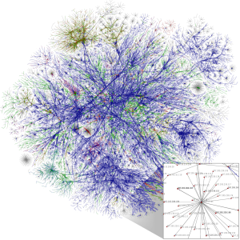

 

I'm in my second week of my second to last quarter of college. It amazing how time flies. I'm looking forward to making the most of these last 20 weeks, and part of that means learning as much as I can.

I'm in two Computer Science Electives at the moment, Software as a Service & Computer Networks. Computer networks is amazing. It's made me think about computers and the way they are connected in some fascinating ways. The first paper weread is system design, and it makes so much sense!

We've also learned that the strength of the internet comes from the mesh-like 'core' with lots of connections that individual computers tap into. The internet is a huge network of networks, comprised of heterogeneous devices that allows the sharing of information at incredible rates! The real power of such a complex system is when we can harness this power and create things in ways never imagined. Just the idea of sharing a document, picture, or project across the sea in a split second has incredible implications for the future of the working world. I don't think people grasp how quickly we've changed the realities of our world. I should probably save my ramblings for another post.

Back to Socket Programming! Our teacher explained sockets as a pseudo-file or port that allows a client server schema to share information. This is much easier said than done, and I'm struggling on a programming assignment that's due in a week because its hard to use the c++ syntax to clearly and intuitively pass information.

The idea of a port or file system makes a lot of sense in my mind though. In Meat Space we use harbors and ports to share things with a linking system (the sea). This just confirms elevates my previous excitement. The real harbors require millions of dollars of infrastructure and resources, but in my room I can establish a connection to anywhere in the world to pass anywhere for essentially pennies on the millions of dollars!

A port, what a beautiful way to think about building a network connection, as if the internet connection was just a beautiful ocean, or even space! That led to me imagining the different parts of a network connection as if it was a Star Wars Space Port! As if Darth Vader could step out of a packet I could send to someone.

This leads to what an ideal programming world could be. If I was able to visualize this building process instead of using convoluted syntax that's difficult to remember and use. Either way I have to do this programming assignment, and the more I think of it like a Star Wars Space port the better it is!

Image Internet Visualization Source: http://en.wikipedia.org/wiki/Internet Image Space Port Source: http://www.screened.com/imperial-star-destroyer/30-45/all-images/132-1590295/shuttle1080i/131-327236/ 
