This post elaborates on a specific learning from our work Athena Intelligence.

One great feature of Azure Web Apps is deployment slots. I recently had an excellent use case for them as a small startup I'm working with is trying out ASP.NET MVC. In the process, we learned how effectively deployment slots allowed their team to work on the project commit code, test it against a test DB as if in production, then quickly swap when ready to the new site and the production database.

Here's a quick sketch to highlight what I'll be demoing today: 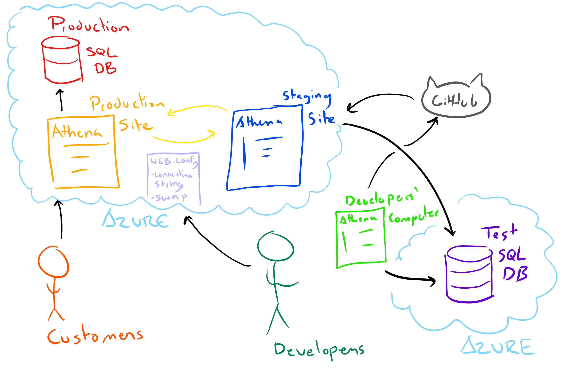

Prerequisites: Azure Subscription GitHub Account + Git Installed

This tutorial provides a specific workflow for deploying and testing code using Visual Studio 2015, Azure SQL Server, and Web Apps for Azure. It is designed to help you quickly get resources into the clowd, supporting users, testing deployments, working with a small devops cycle and learn by doing.

There are 10 parts to this tutorial: Creating a Azure SQL Server Instance in a Resource Group Creating a Web App in Visual Studio Push Your Project to GitHub and add Version Control Create a Web App in Azure Create a deployment slot Connect the Staging Slot to your GitHub Repository Update the Application Settings to connect to your Test Database Check Data is Entering the Database Move onto production setup Make the swap

**1\. Creating a Azure SQL Server Instance in a Resource Group**

Go to https://portal.azure.com

Select new > SQL Database

Database name: TestDatabaseJanuary Create new or use existing Resource group (creating a new one makes it easier to tear down when done) Server: Create a new server - name = januarysqlserver, admin login = conductor, password = d0nt4get! location = same as everything else in Resource group Select a price and select create.

Here's what it looked like for me: 

After the SQL DB instance is spun up and the database is provisioned, go to the overview page. In the top right corner you can see the name of the server hosting this DB, and a show connection strings link: 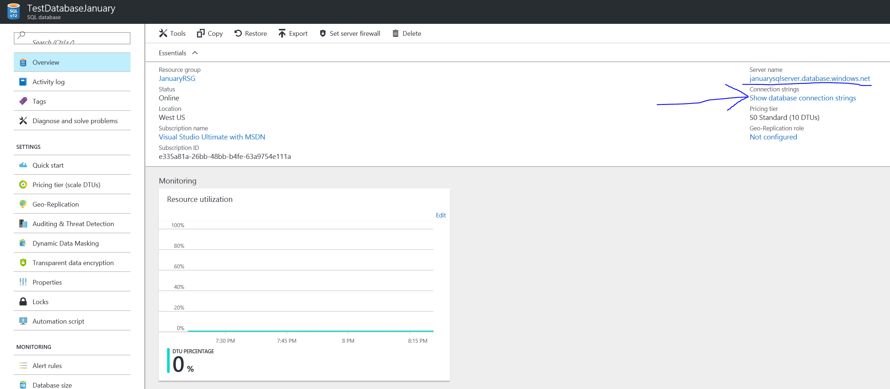

After selecting that link, you'll see a number of different connection strings. In this case, we'll be using ADO.NET to connect to it from an ASP.NET web application. 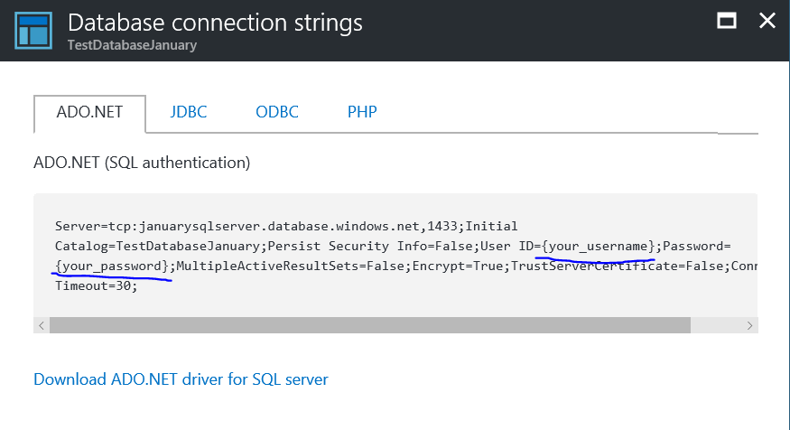 Keep track of that string. You'll also notice that the 'username' and 'password' are left empty. That's the username and password you set when you created the SQL server instance.

Now that we have a Database ready to go, let's get a web app connected to it.

**2\. Creating a Web App in Visual Studio**

Open up any Edition of Visual Studio 2015 and select File > New Project.

Then select Templates > Visual C# > Web. You'll see ASP.NET as an option. Give it a name e.g. MyDemoApp Then Press okay. 

You'll then be met with an MVC Scaffolding page: [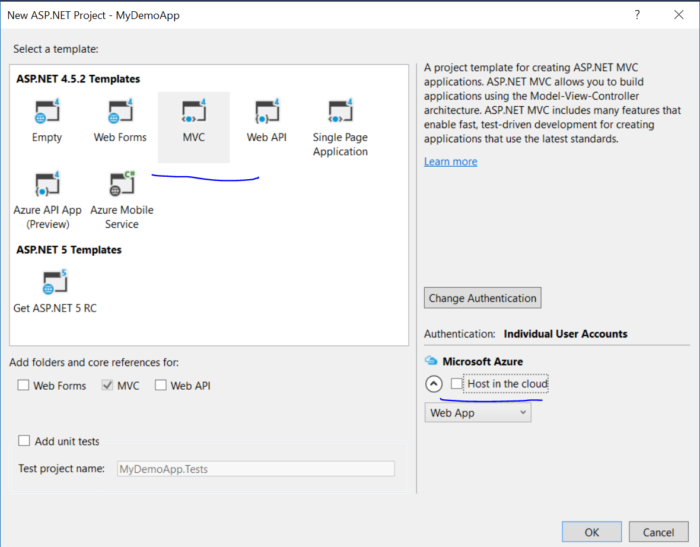](http://timmyreilly.azurewebsites.net/wp-content/uploads/2017/01/SelectingMVCIndividualAccounts.png)

Select MVC and make sure the authentication is "Individual User Accounts" For now I've unselected `"Host in the Cloud"` we'll take care of this later.

Press Okay again and you'll soon have a basic web application using ASP.NET MVC with User Authentication Cooked In.

Press F5 or select the green arrow on the toolbar of Visual Studio to see you application: Right now when you register an account you're updating a localdb called MSSQLLocalDB [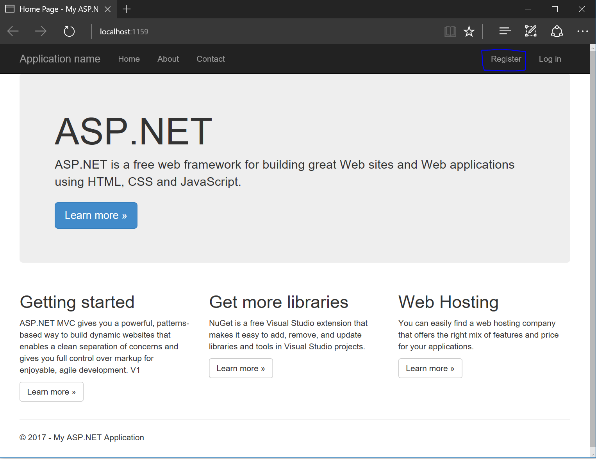](http://timmyreilly.azurewebsites.net/wp-content/uploads/2017/01/DefaultWebApp.png)

BONUS: You can test your database from your local machine by editing your Web.Config Connection strings. Change the "DefaultConnection" from local to the string connection string provided by the Azure SQL Server Instance:  This isn't required for this tutorial but good to know if you want to see if its working meow.

**3\. Push Your Project to GitHub and add Version Control**

In this case we're going to use Git via the command prompt. Open up a command prompt to you DemoApplication Directory:  And enter the command `C:\echo > .gitignore` This will create a .gitignore file. We want this file next too your .sln file.

Open the .gitignore file with your favorite text editor and copy the contents of this file into it: [https://raw.githubusercontent.com/timmyreilly/ASPNETDeploymentDemo/master/.gitignore](https://raw.githubusercontent.com/timmyreilly/ASPNETDeploymentDemo/master/.gitignore)

Should look like this, make sure \*.mdf and \*.ldf are in your .gitignore: [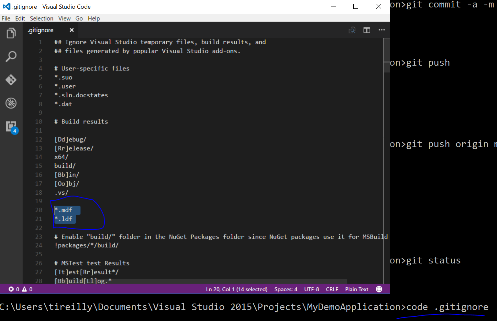](http://timmyreilly.azurewebsites.net/wp-content/uploads/2017/01/YourGitignore.png)

Save the file and close the text editor.

Now go to GitHub.com and create a new repository: [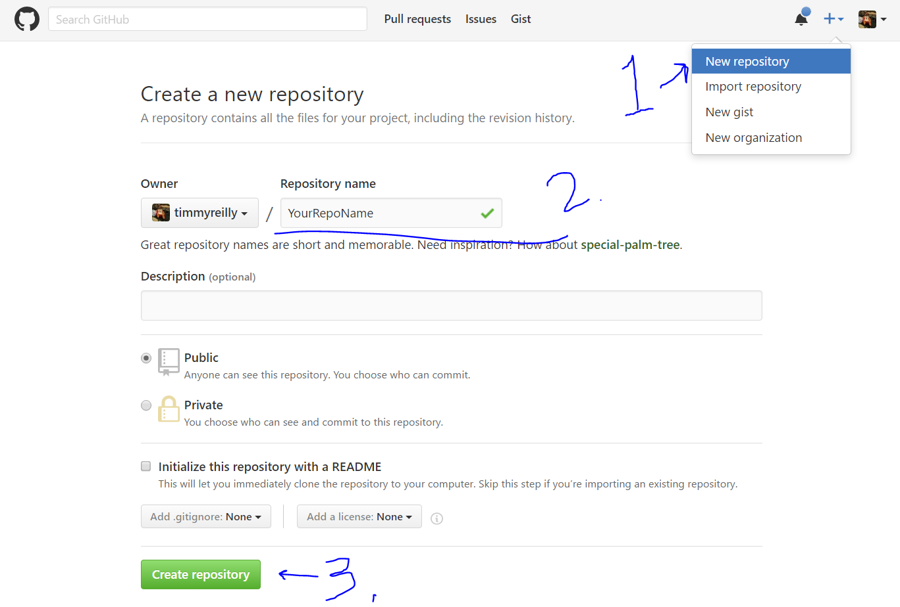](http://timmyreilly.azurewebsites.net/wp-content/uploads/2017/01/CreateGitHubRepo.png)

Next, Initiate the repository, add your files, and commit your code. These instructions on the github page are accurate:  And here they are again: `C:\ echo # MyDemoApp >> README.md C:\ git init C:\ git add . C:\ git remote add origin http://yourrespoastaoisdgaosuhd.git C:\ git push -u origin master` And what it looked like on my machine: [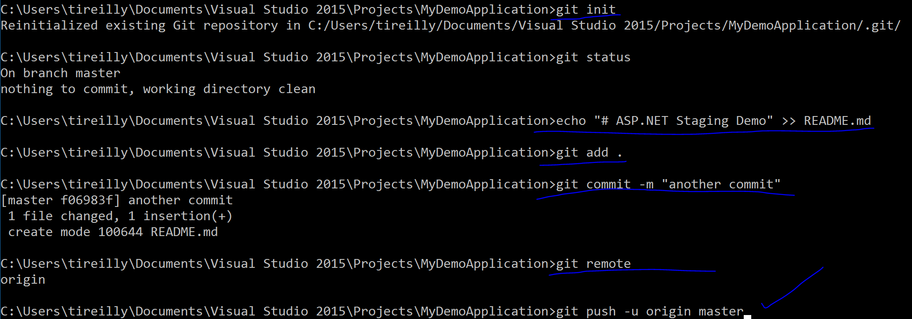](http://timmyreilly.azurewebsites.net/wp-content/uploads/2017/01/InitialCommit.png)

Great! [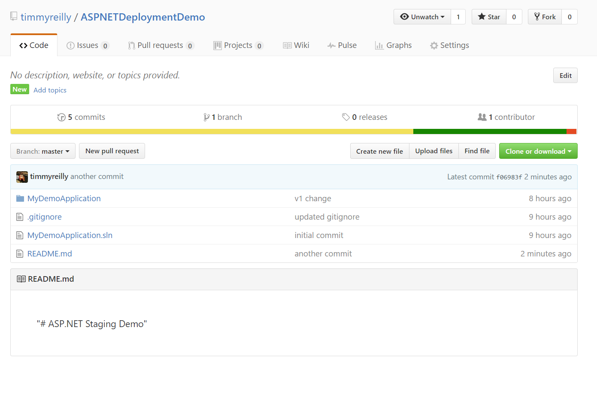](http://timmyreilly.azurewebsites.net/wp-content/uploads/2017/01/YouShouldHaveGitHubLikeThis.png)

You now have code in a GitHub repository that you can share with lots of different developers. As they push changes we want to see how they look and if they break the application, so let's go create a web app.

**4\. Create a Web App in Azure**

Go to the Azure Portal and the resource group that has the SQL Database we created earlier Select add in the top left corner > Then Search Web App: [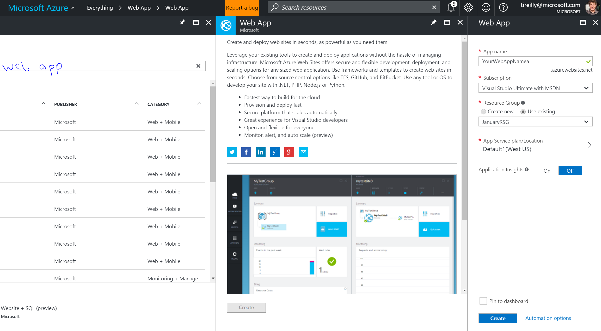](http://timmyreilly.azurewebsites.net/wp-content/uploads/2017/01/creatingawebapp.png)

Here you can see I've configured the name and placed it in the same resource group.

After that's provisioned we can can make our first deployment slot!

**5\. Create a deployment slot**

Go to the overview blade of your Web App and select "Deployment Slots" [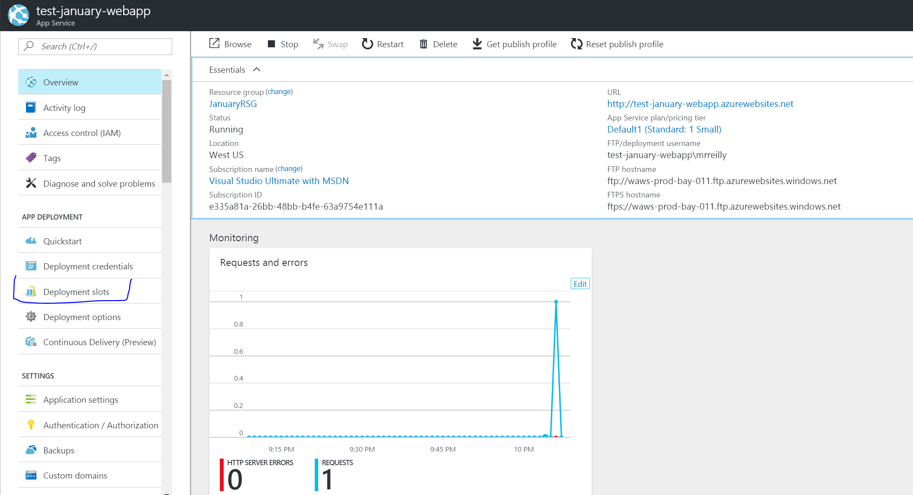](http://timmyreilly.azurewebsites.net/wp-content/uploads/2017/01/SelectDeploymentSlot.png)

Then Add Slot in the top left corner. Now create a slot called "staging" [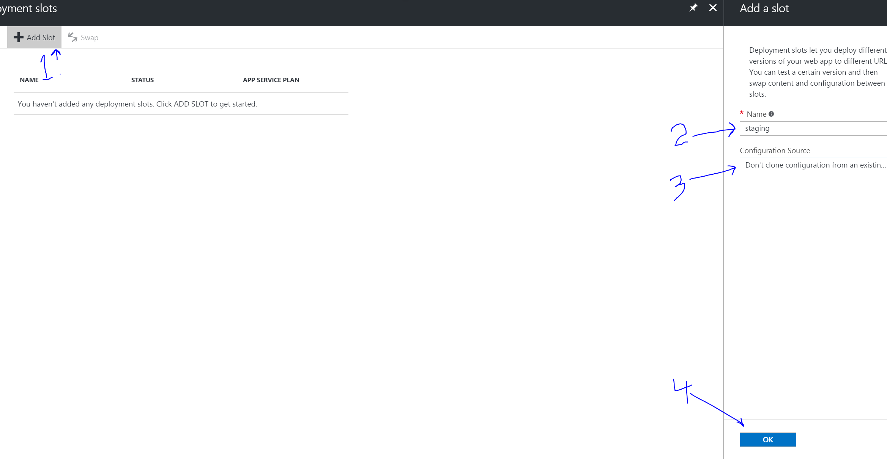](http://timmyreilly.azurewebsites.net/wp-content/uploads/2017/01/createstagingslot.png) You can create as many slots as you want. They are essentially other Web Apps that are related to each other.

It will take a second to spin up, but once ready you can treat it like its own web app.

**6\. Connect the Staging Slot to your GitHub Repository**

Select the staging slot and select "Deployment Options": [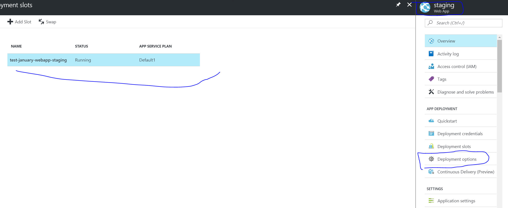](http://timmyreilly.azurewebsites.net/wp-content/uploads/2017/01/SelectDeploymentoptionsOnStagingSlot.png)

You now get to pick a deployment source. In this case, we're going to use GitHub. You'll authorize Azure to pull your repositories and choose the ASP.NET Project you created a repository for in step 3: [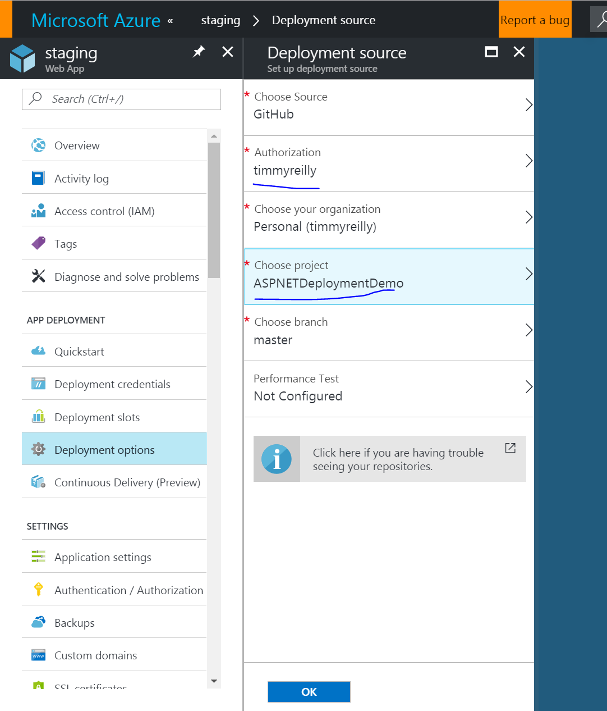](http://timmyreilly.azurewebsites.net/wp-content/uploads/2017/01/SelectGitHubDeployment.png)

**7\. Update the Application Settings to connect to your Test Database**

Now that the project is deploying from the GitHub we need to connect it to a database to support the user login functions. We have the code, now we need the data. Go to the Application Settings and scroll down to connection strings. Set the name to: DefaultConnection And the Value to something like this: Server=tcp:januarysqlserver.database.windows.net,1433;Initial Catalog=TestDatabaseJanuary;Persist Security Info=False;User ID={your\_username};Password={your\_password};MultipleActiveResultSets=False;Encrypt=True;TrustServerCertificate=False;Connection Timeout=30;

This is the connection string we took down in step 1. Note: the {your\_username} and {your\_password} needs to be substituted with the SQL Server settings you set during step 1. It can be helpful to make the changes in a text editor before copying into that small textbox.

Also make sure you mark this as a slot setting. This tags this setting to only be used in this slot and is really the meat of this whole operation.

Here's what that looked like for me: [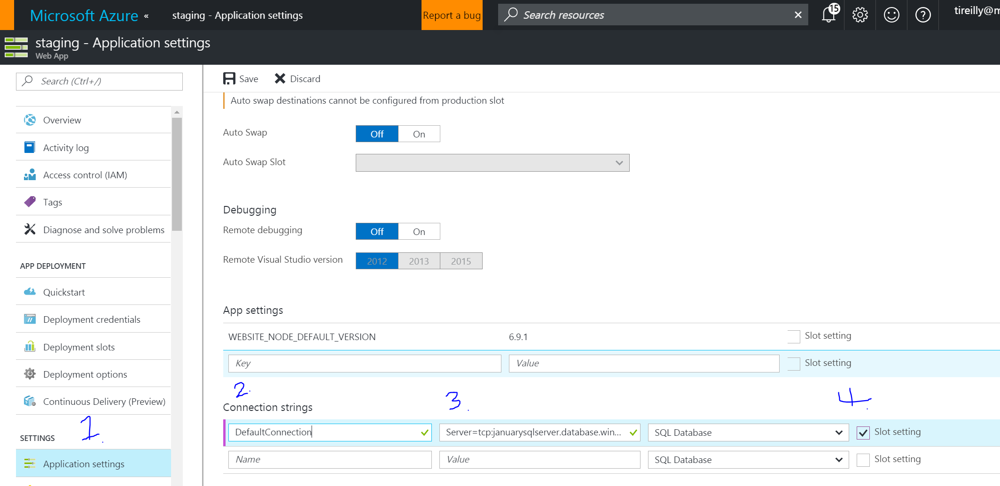](http://timmyreilly.azurewebsites.net/wp-content/uploads/2017/01/ApplicationSettingsForStagingSlot.png)

Go back to the overview for the staging slot and select the url to visit your new site. Try registering some accounts and making sure everything works properly. If you get errors during registration that might be because the string was copied improperly or you used the wrong username and password. Try again, that's what the cloud is for!

Here's my site url and me registering an account: [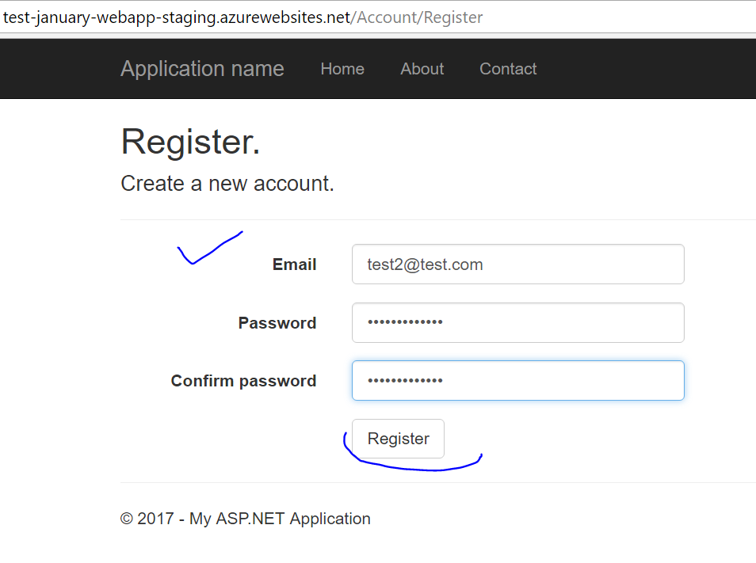](http://timmyreilly.azurewebsites.net/wp-content/uploads/2017/01/RegisterTestAccount.png)

Nice!

**8\. Check Data is Entering the Database**

Visual Studio 2015 has a SQL Object Explorer cooked in! It makes it super easy to check the state of your database and make sure you're getting data.

Go to Visual Studio select View -> Server Explorer from the toolbar. [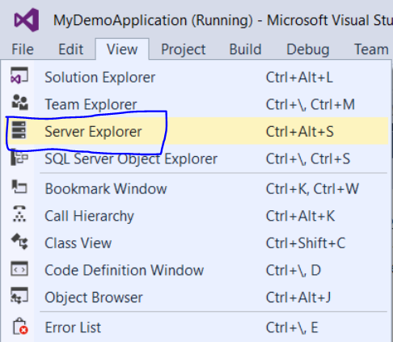](http://timmyreilly.azurewebsites.net/wp-content/uploads/2017/01/OpenSQLExplorer.png) Now select connect to Azure Subscription if there isn't one there already.  Login with the same credentials you do when you go to the portal in the browser. Once connected drop down into SQL Databases and right click on the "TestDatabase" and select "Open in SQL Server Object Explorer"  Now open YouDatabaseName > Tables > Right Click AspNetUsers > Select "View Data" [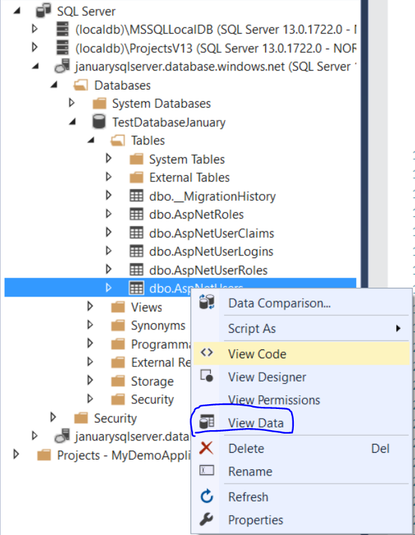](http://timmyreilly.azurewebsites.net/wp-content/uploads/2017/01/RightClickViewDataOnUsers.png) Here's a couple results from my data: 

Isn't that sweet!?

**9\. Move onto production setup**

Now we have a working web app talking to a test database. Let's create a production Database just like we did in step one and connect our web app to that. I followed the same steps as Step 1, but now named the Database JanuaryDemoProductionDB: 

And grabbed the connection string: Eg: Server=tcp:januarysqlserver.database.windows.net,1433;Initial Catalog=JanuaryDemoProductionDB;Persist Security Info=False;User ID={your\_username};Password={your\_password};MultipleActiveResultSets=False;Encrypt=True;TrustServerCertificate=False;Connection Timeout=30;

Now let's go place this in our original Web App Connection string. Don't forget to mark it as a slot setting. 

Okay, time for the big finale. This represents the future of our development workflow. Let's go make a small change in our local copy of the web app.

Here you can see I changed the text on the home page: [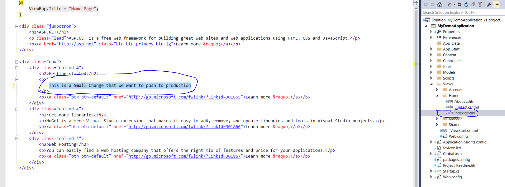](http://timmyreilly.azurewebsites.net/wp-content/uploads/2017/01/SmallChangeToHomePage.png)

Now we commit the change and push to github: [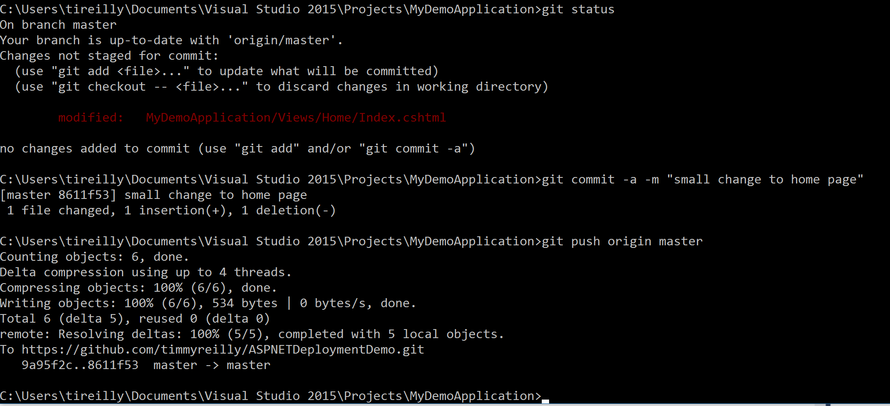](http://timmyreilly.azurewebsites.net/wp-content/uploads/2017/01/committingthesmallchange.png)

The Staging slot picks up on this change and deploys the changes to our staging slot: 

We check the staging slot site to make sure everything is still working  Looks good! And we can still login with our test accounts.

**10\. Make the Swap!**

Now let's put it into production!

Select Swap from the Overview Blade of our Main Web App (not staging): 

Select the source and destination of the swap: 

And wait a minute: 

Now go visit your production site! http://test-january-webapp.azurewebsites.net/

And try to login with one of your test accounts. No Luck! This slot is now on its own db. [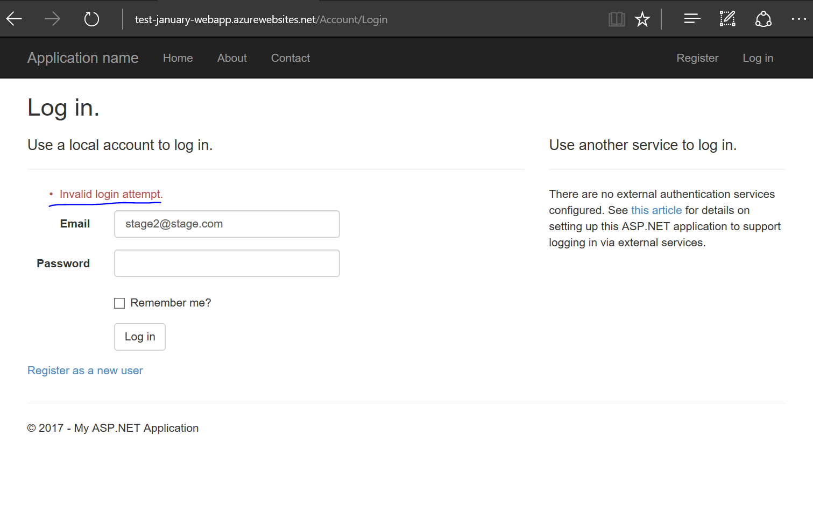](http://timmyreilly.azurewebsites.net/wp-content/uploads/2017/01/InvalidLoginAttempt.png)

Not very often you get to be excited about invalid login attempts!

**10b. Finally**

Now you can keep pushing changes to GitHub without worrying about messing up your production environment. After everything checks out, you can push it over to production and your customers.

Thank you deployment slots!

Let me know if you have any questions in the comments below or say hi on Twitter: @timmyreilly

\[caption id="attachment\_9791" align="aligncenter" width="2160"\] Really looking forward to the next generation of Surface. \[/caption\]
