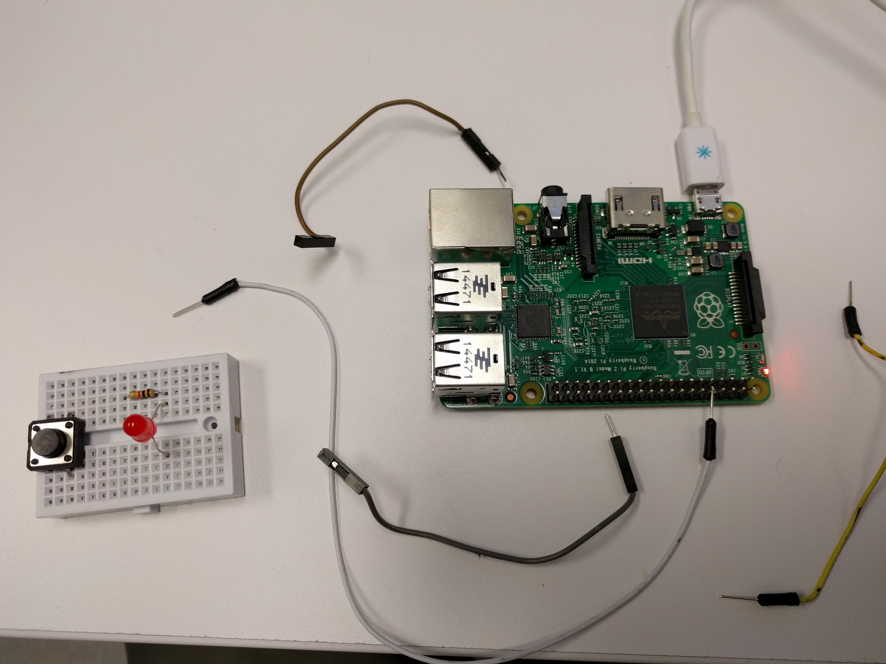
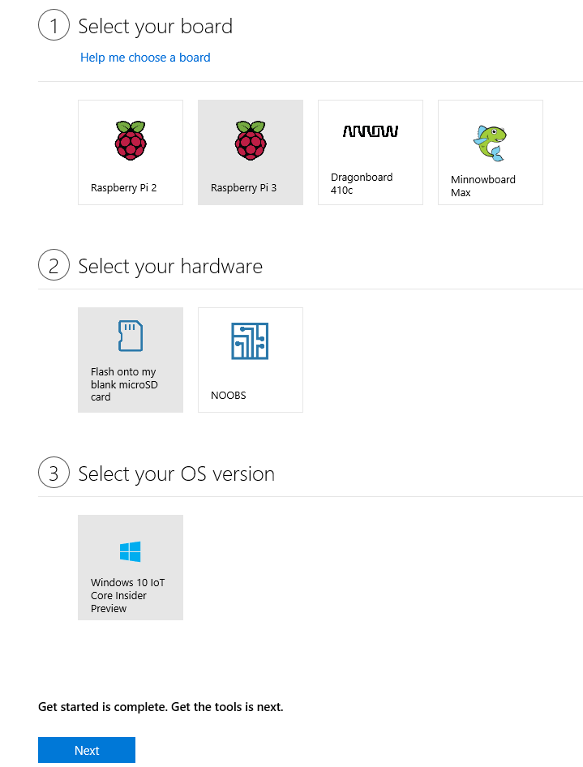
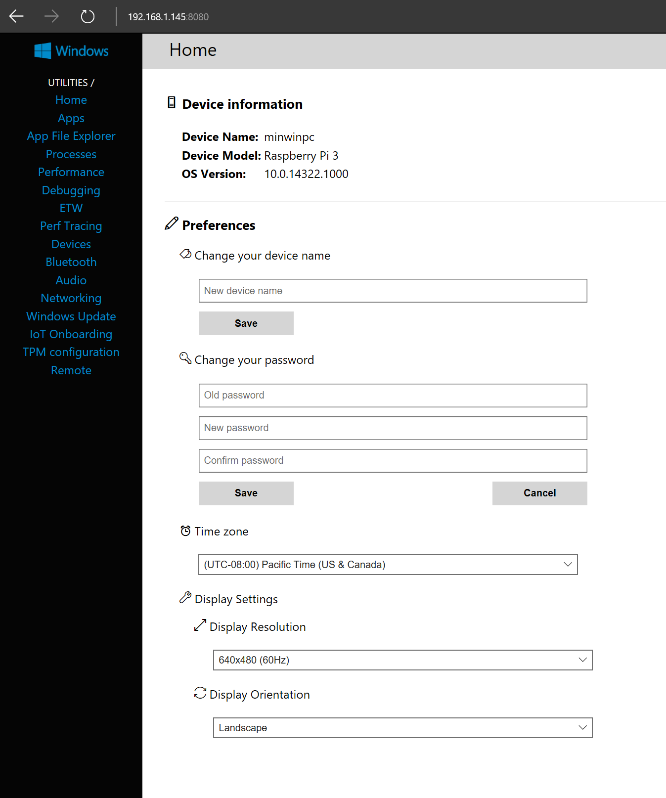
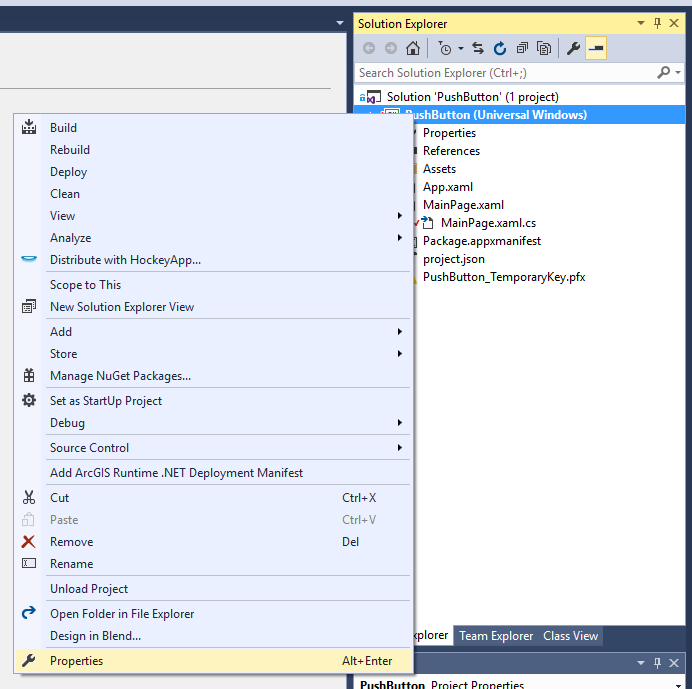
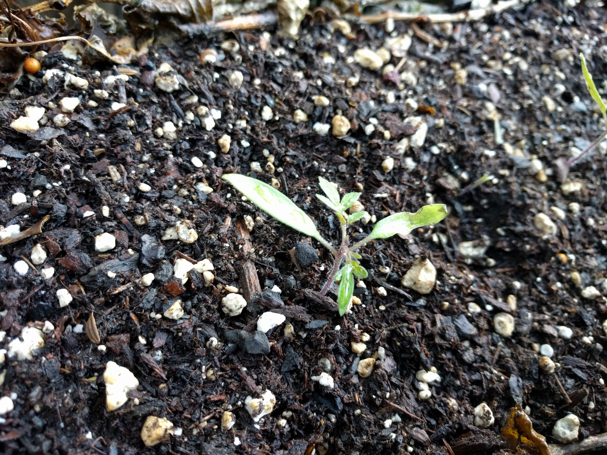

IoT and Windows are Better than ever with the new IoT Core for Raspberry Pi.

In this workshop we'll have deploy [Universal Windows Platform Code](https://msdn.microsoft.com/en-us/windows/uwp/get-started/universal-application-platform-guide) to a Raspberry Pi and begin communicating with the cloud and cloud services in the form of an [Azure IoT Hub](https://azure.microsoft.com/en-us/services/iot-hub/).

The steps include: 1. Gathering the materials 2. Preparing the Raspberry Pi 3. Installing our software 4. Connecting our LED and PushButton 5. Connecting to our raspberry pi 6. Deploying our push button app 7. Connecting our app to IoT Hub 8. Connecting our app to weather data

**1\. Gathering the materials**

For this workshop you'll need about $55 worth of hardware, but all the software is free.

Hardware: 1 [Raspberry Pi 3](http://www.microsoftstore.com/store/msusa/en_US/pdp/Raspberry-Pi-3-Board-and-16GB-10class-with-NOOBS/productID.334851400#) (It has built in Wifi!) 1 Micro USB to USB Cable 1 [Breadboard](https://na01.safelinks.protection.outlook.com/?url=http%3a%2f%2fwww.amazon.com%2fPhantom-YoYo-Points-Breadboard-Arduino%2fdp%2fB016Q6T7Q4%2fref%3dsr_1_2&data=01%7c01%7cTim.Reilly%40microsoft.com%7ccf24011a98f543de324c08d3705f9d03%7c72f988bf86f141af91ab2d7cd011db47%7c1&sdata=VhzHwQoFyBzdS9XkZpDydXV6QrgHrJTULW8YgNEp0r8%3d) 4 [Female/Male Jumper Wires](https://www.adafruit.com/products/1954?gclid=CjwKEAjw6_q5BRCOp-Hj-IfHwncSJABMtDaiBK9QHaUdEOq6BmPiQK3r3ZOE_nuehmpwgU1l2Eg_ABoCpvrw_wcB) 1 [Push Button Switch](https://na01.safelinks.protection.outlook.com/?url=http%3a%2f%2fwww.amazon.com%2f6x6x4-5mm-Momentary-Tactile-Button-Switch%2fdp%2fB008DS1GY0%2fref%3dsr_1_2&data=01%7c01%7cTim.Reilly%40microsoft.com%7ccf24011a98f543de324c08d3705f9d03%7c72f988bf86f141af91ab2d7cd011db47%7c1&sdata=ahkJb29XStJdrOh3%2bBEe%2f1%2b%2fCnJP1wbMgOlduhzVmDo%3d) 1 [led](https://na01.safelinks.protection.outlook.com/?url=http%3a%2f%2fwww.amazon.com%2fmicrotivity-IL451-Clear-White-Resistors%2fdp%2fB007SJ8XP0%2fref%3dsr_1_2&data=01%7c01%7cTim.Reilly%40microsoft.com%7ccf24011a98f543de324c08d3705f9d03%7c72f988bf86f141af91ab2d7cd011db47%7c1&sdata=fiwM76nPlvmmOalePVDzTF84JZcJ0PH9m1JF7%2bIe%2bRk%3d) 1 [200 ohm resistor for said led](https://na01.safelinks.protection.outlook.com/?url=http%3a%2f%2fwww.amazon.com%2fmicrotivity-IL451-Clear-White-Resistors%2fdp%2fB007SJ8XP0%2fref%3dsr_1_2&data=01%7c01%7cTim.Reilly%40microsoft.com%7ccf24011a98f543de324c08d3705f9d03%7c72f988bf86f141af91ab2d7cd011db47%7c1&sdata=fiwM76nPlvmmOalePVDzTF84JZcJ0PH9m1JF7%2bIe%2bRk%3d) 1 Monitor with HDMI out

Software: Windows 10 Machine version 10.0.10240 or better. [Visual Studio 2015 Update 2](https://www.visualstudio.com/en-us/visual-studio-homepage-vs.aspx) [The Windows 10 IoT Core Dashboard](http://go.microsoft.com/fwlink/?LinkID=708576  Git) Git

\[caption id="attachment\_7291" align="aligncenter" width="4032"\] Here's my little setup\[/caption\]

**2\. Preparing Our Pi**

The windows developer site has very clear instructions for setting up your device with the proper operating system so lets hop over there.

[developer.microsoft.com](https://developer.microsoft.com/en-us/windows/iot/getstarted)

If you follow these instructions all the way to Step 4 of 4 you're ready for step 5 on our workshop. So skip ahead if you followed along there.

I'm working with a raspberry pi three so my selection screen looks like this:

**3\. Install the dashboard and Flash the OS** Next we'll download the dashboard as prompted by the site

Then we'll download the ISO of the raspberry pi image we want to use, then click through installer.

Once installed we can use the IoT Dashboard to flash the image onto our SD card in the form of a .ffu

Then we'll connect the device to the network by selecting configure device.

Really though the instructions are super clear [RIGHT HERE](https://developer.microsoft.com/en-us/windows/iot/win10/GetStarted/rpi3/sdcard/insider/getstartedstep2)

**4\. Install/Update Visual Studio**

We need Visual studio Update 2 to build our IoT Application, so make sure you're up to date!

Or go here to install it: [https://www.visualstudio.com/vs-2015-product-editions](https://www.visualstudio.com/vs-2015-product-editions)

_Seriously though, they did an awesome job with the documentation. If you followed along to their step 4 you're ready for our step 5._

**5\. Connecting our LED and PushButton**

Now that we have our pi configured and Visual Studio up to date, let's plug in our neat hardware!

Here's an overview of the pin layout for the raspberry pi 3: 

And the wiring diagram for the led + push button looks like this:

Sweet, lets light it up!

**6\. Connecting to our raspberry pi**

We need our raspberry pi's IP address before we try to deploy our code. Power it up with a micro USB cord and connect it to a monitor with HDMI and see the landing page for your machine.

With the Windows IOT Core Come a super helpful web portal that allows you to configure your machine through a browser.

Navigate to that IP: http://you.have.an.ip:8080/ https://192.168.1.145:8080/ is the IP address of my machine when I tried this

You'll be prompted with a login panel. The default user name is: Administrator The default password is: p@ssw0rd

Here's what you should see in the portal: 

From here you can configure the name/password, get network info like the MAC address under Networking, and even test out some samples.

Sweet! This is one of my favorite Window IoT Features.

**7\. Deploying our push button app**

The pi is setup, our computer is updated with the newest build tools, now its time to deploy some code!

Go here and clone this repo to a dev directory: [https://github.com/timmyreilly/RaspberryPiWorkshop](https://github.com/timmyreilly/RaspberryPiWorkshop) And setup visual studio debugging by right clicking on PushButton project like this: 

Then under debug set the remote machine ip to the ip you collect from the IoT Dashboard or from the raspberry pi itself by plugging in a monitor.  You will then need to rebuild your solution, and restore nuget packages.

Poke around for a minute, put a break point in the buttonPin\_ValueChanged method and step around to see what's going on with the push button.

**8\. Connecting our app to IoT Hub**

Next we're going to turn on the IoT Hub Connection. Go into the azure portal and create a new IoT Hub like this:  Then create a new device called MyDevice in the IoT Hub.

More information about the IoT Hub can be found [RIGHT HERE](https://blogs.windows.com/buildingapps/2015/12/09/windows-iot-core-and-azure-iot-hub-putting-the-i-in-iot/).

Then we'll want to add our connecting strings to the app at the very bottom of MainPage.xaml.cs

`static string iotHubUri = "YOURHUB.azure-devices.net"; static string deviceKey = "TOKENasQOPUesD1BmSOMETHINGCOMPLICATED"; static string deviceId = "MyDevice"; // your device name`

Next we'll uncomment this line of code on line 78: `SendDeviceToCloudMessagesAsync();`

To see what's happening in the event hub there is a small console application that we'll run alongside to see what's making into the cloud.

You can find that code here: [https://github.com/timmyreilly/IoTHubConsoleReader](https://github.com/timmyreilly/IoTHubConsoleReader) Open that in visual studio and replace the connection string with the one provided in the Azure Portal.

`string connectionString = "HostName=YOURHUBNAME.azure-devices.net;SharedAccessKeyName=iothubowner;SharedAccessKey=YOURSECRETOKENqf"`

Sweet, now run both those apps at the same time, push the button, and see the glory that is Internet of things.

**9\. Connecting our app to weather data**

Now that we've got it talking to the cloud, lets listen to what the clouds have to say!

We're going to use forecast.io to provide weather data to our app, then use Speech. Synthesis to read it out over a the audio jack.

Navigate to [forecast.io](https://developer.forecast.io/) and signup register an account, then copy the complicated token highlighted here:

And replace what you see at line 168: `private const string FORECAST_URL = "https://api.forecast.io/forecast/YOURSECRETOKEN/";`

Then if you want to be more specific about where you're getting weather data replace the string on line 76. `var words = await GetWeatherString("37.8267,-122.423")`

Make sure that the code in lines 72 through 81 are uncommented.

Deploy the app, press the button, and listen to the weather like never before!

It's all very simple code and ready to be spun into lots of fun projects. Here's a list of all the ones that me and my friends could thing of: Tap into the band app cloud Morse code Dance party Send a random act of kindness Tap into yammer Time to finish breast feeding start and stop button Random stats button Gives you weather, or distance walked Morse code each other Send bro to someone random - twilio Launch a middle Listener recognition and ignore Competitive button clicking Obscure metadata Best reflexes tester

Hope you had fun getting started with Windows IoT!

This workshop wouldn't be possible without the help provided by the community. Here are some of the helpful posts that help me learn: [Windows 10 IoT Core Speech Recognition](https://www.hackster.io/krvarma/rpivoice-051857) [Windows 10 IoT Core Speech Synthesis](https://www.hackster.io/krvarma/rpispeechsynthesis-51f269) [All The ms-iot samples](https://github.com/ms-iot/samples)

Feel free to ask me questions in the comments or on twitter [@timmyreilly](https://twitter.com/timmyreilly)

\[caption id="attachment\_7301" align="aligncenter" width="4032"\] TOMATOES IN PROGRESS\[/caption\]
