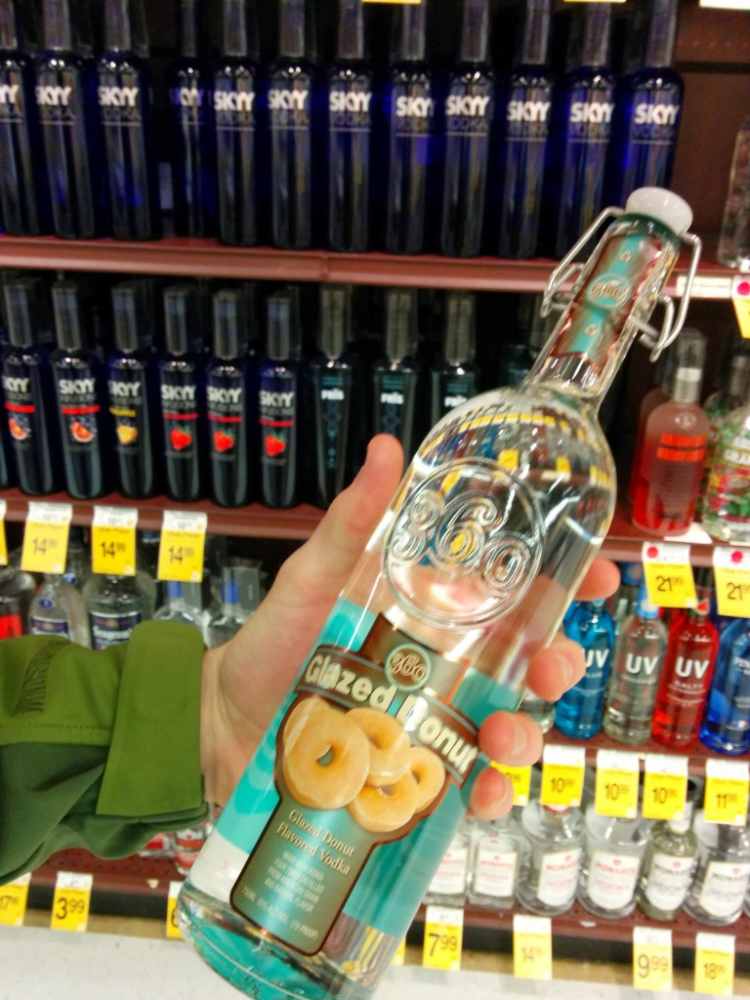

To be considered for marketing and sales products, good questions to ask to design, pitch, and sell any type of idea or product, from ethical dilemmas to new flavors of yogurt. Think of it as different branches of the tree to sales. All the light and ideas come from different angles to different sized branches, and you need to design the best tree for the customer using these basic elements, while intertwining them with the finesse and organic delicacy of a tree growing into the air. Man this is already sounding ridiculous, but its a lot of fun to think about, and helps me when I want to understand something and/or its importance.

Who Who needs the products. Who it's for specifically. Why they specifically should by it. Consider their situation, and recognize the challenges they specifically face, and connect it your you product.

What What is it. It's name It's design The features and attributes (Possibly what it costs, depends on how strong the why is) What it's like, why its different. The customer needs to clearly see what their getting into in order to trust it, and have full understanding before they make a purchase.

Where Where you get it. Where's it made. How to physically purchase it Where you'll use it Where it'll come in handy, and make a difference. Where to buy replacement parts Where to find more information You need to give them the spacial understanding of every aspect that surrounds this product. From local products and product families, to how to pick it off the shelf.

When When it lines up in the timeline When you use it When you're mother used it, or someone else you care about. When it'll come in handy, when you'll be glad you have it. When it stacks up to creation of other products and ideas. New product is new, it comes as a logical progression from what has come before. When you know when the products is important, you can fully grasp what it does, and understands its path to getting into use.

Why Why it'll be better. Why it works the way it works. Why that's better Why you should waste your time buying or even looking at it. Why your friend bought. Why anyone bought it. Why your making it Why is the justification for everything, so when someone asks why you don't look like a fool. I care about this category probably the most, right alongside how. It's important for you to rationalize it in your own head. Be able to say the why back to yourself in your own head, to convince yourself that everything is okay. Without a good why, things might not be okay.

How How this product is going to deliver. How your making it. How this product is going to make your life better. Change the way things are done, make you reconsider the way things are done. Show to cause and affect of it using it. They need the logic of it success. If its as successful as you say it is show it, show me and show me why/how it pulls of these feats of incredible value to the customer.

Logic It has to be logical, people don't like buying magic. They want something they can wrap their heads around at least to some degree. Cell phones are interesting example of this. People should easily be able to easily configure their devices. It teaches them about how it works, and gives them a logical mapping of the interface. Smartphones without configuration need to be really simple because you'll never understand what going to a new page means or entitles. The balance between the way we use something and interact with and even configure it can be limit are ability to comprehend the logic. Wordy as this may seem. The logic of any product must be able to be comprehended easily or with simple training, or at least in some way addressed, whether in marketing or just being recognized as too complicated to be worth trying to understand. In cases of abstraction it may not mattered. Like logic of circuitry doesn't matter to me dragging icons around the homescreen.

Sentiment Products take on relationships with customers. Their part of memories, experiences, stories, people and places. It natural, sometimes we might do it too much, but we can't deny it from happening and with sales or marketing that important to consider. The people want to know what a relationship with this product looks like. How it will fit into your stories.

Tradition We like to keep doing things we know how to do. Doing something we don't know how to do can feel like a waste of time. So if this matches with your traditional way of getting things done to some degree it going to be easier to pick it up and use it, as if it was your old trusty tool, and when you get the same feeling along with something that works well. It's hard to say no.

Morality It the product is connected to any type of goodness it should be highlighted. If its good for the earth good for the employees, good for the world, you need to consider that and relate it to your product or keep it away from your product. If you really have to hide the ethical or moral repercussions of your product you probably shouldn't be selling it though.

Emotions We are emotional creatures. Well at least I know I am. And that's a good thing, but pulling on the heartstrings can sometimes seem like a bit of a low blow. Like associating puppies with your product. That's cool and or how it will save the pandas. That's cool and all, but if you layer to thick, you run the risk of making the client thing their bad if they don't and that probably doesn't do well for repeat sales. Unless you keep layering, and their your kind of being mean by emotionally manipulating someone. Anyways... But emotions are still important to consider. You should highlight the positive emotions with the product within reason, and maintain authenticity as much as possible.
