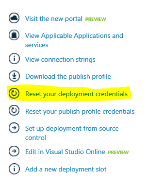
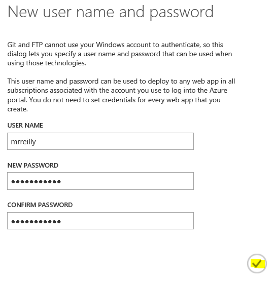
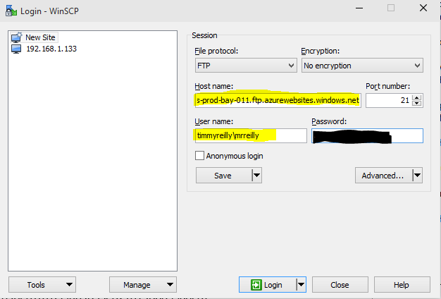
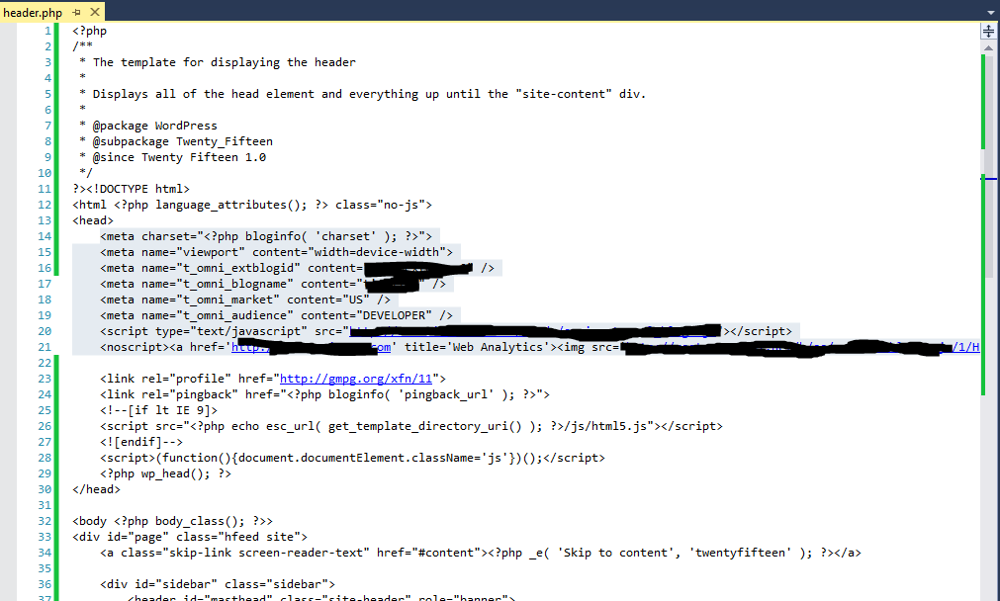

Site tracking is cool because information is cool! This tutorial will show you how to configure analytics for a Wordpress blog by editing the Header.php file using FTP.

\[sourcecode language="html"\]\[/sourcecode\]

**Let's imagine your company gave you something like this to begin analytics:** `<meta name="t_omni_extblogid" content="contosotextblogs" /> <meta name="t_omni_blogname" content="alias" /> <meta name="t_omni_market" content="US" /> <meta name="t_omni_audience" content="DEVELOPER" />  <noscript></noscript>`

&amp;amp;lt;a href='http://www.omnicron.com' title='Web Analytics'&amp;amp;gt;&amp;amp;lt;img src='http://something.fancy.com'&amp;amp;nbsp; height='1' width='1' border='0' alt='' /&amp;amp;gt;&amp;amp;lt;/a&amp;amp;gt;

The only thing you should have to change is the "alias" to your personal alias.

Of course I've edited this snippet because we don't won't everybody to add analytics to their blog…

Okay, so you have your snippet. **Where do you put it?**

Let's say your hosting your Wordpress blog on Azure. You have a number of different ways to access these files.

The simplest is probably using an FTP client such as WinScp. An FTP client will allow you to change files on the remote directory.

[Here's the link to download WinSCP](http://winscp.net/download/winscp572setup.exe):

After you install WinSCP you should see a page like this: 

Make sure you set the File Protocol to FTP.

**Now go to Azure** Here's the link to Azure: [http://portal.azure.com/](http://portal.azure.com/)

Now go into azure to find the Host Name, User Name, and Password 

In the current portal you'll find all the information on the Dashboard. You can find the FTP hostname and the Username about halfway down the page on the right.

And if you don't know your password you can set deployment credentials from the same page. Simply click here:

Set your credentials, and remember your password.

Now open WinSCP and enter your credentials alongside the FTP Host Name

Now that you're logged in your can explore the files just like your regular file explorer! We're going to find the header file of your current theme and add the code snippet!

**Check the path and the highlighted file!**

Now double click on that file to open it in your favorite text editor.

_Here you can see where I've pasted in my code._

**Save the file and it will be saved on your Azure directory and you're ready to go!**

You can double check to see the changes. Go back to your azure portal and actually click on the FTP host link. This will open a new tab and will ask for the same credentials.

Once inside you'll be able to explore the Directory contents in your browser.

Check the path at the top to see my current location and notice that I can open the file right here to check the contents!

Looks good from here too!

Now everytime anyone opens a page on your blog data traffic data will be sent to your analytics platform.

Let me know if you have any questions!

\[caption id="attachment\_4291" align="aligncenter" width="2000"\] The Kannon at //Build.\[/caption\]
